# A TSE per cash register
This guide walks you through the most basic setup with one dedicated cashbox (one *Queue* and one *SCU/TSE*) for each cash register.

## 0 - Prerequisites
As dealer please make sure you have used the **surrogate function** first to **enter your client's account and make subsequent changes in that context**.

## 1 - Creating the SCU
### Step 1 - Navigating
Choose `Configuration` - `Signatur creation unit` from the left-hand menu.

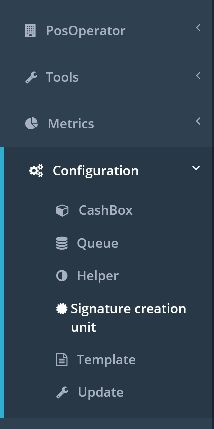

### Step 2 - Selecting the add option

Click the `Add` button.

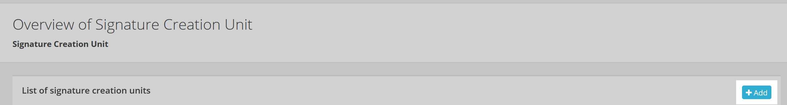

### Step 3 - Entering the details
Enter an appropriate description for your new SCU, choose the right package and version applicable to this particular TSE (*for the German market*), and select the outlet in which this SCU should be active.

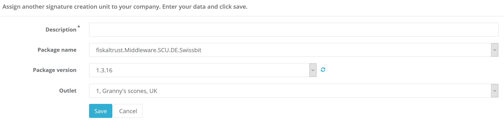

Once you have entered all information, click `Save` and you'll be redirected to the screen where you configure additional technical details, such as **SSCD-specific settings** (*e.g. in the German market, details of the TSE you have just chosen*) as well as the **URL** (*including the desired communication protocol*) under which the SCU should be accessible for the queue.

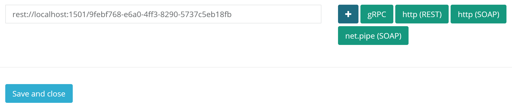

Once you have finished the configuration, click `Save and close` and the new SCU should be listed on the subsequent screen of all your client's SCUs.

## 2 - Creating the Queue
### Step 1 - Navigating
Choose `Configuration` - `Queue` from the left-hand menu.

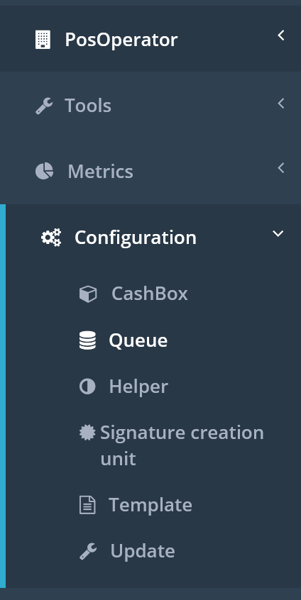

### Step 2 - Selecting the create option
Click the `Create new` button.

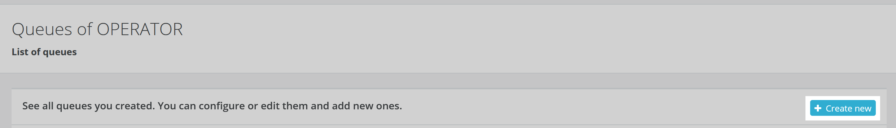

### Step 3 - Entering the details

Enter an appropriate description for your new queue, choose the right package for the desired backend storage and the applicable version, enter the desired timeout (default 15,000 milliseconds), enter the serial or identification number of your cash register (*or tick `Generate Identifcation` to let middleware generate a unique number*), and select the outlet in which this queue should be active.

The country code is already pre-selected based on the national ft.Portal you signed in to.

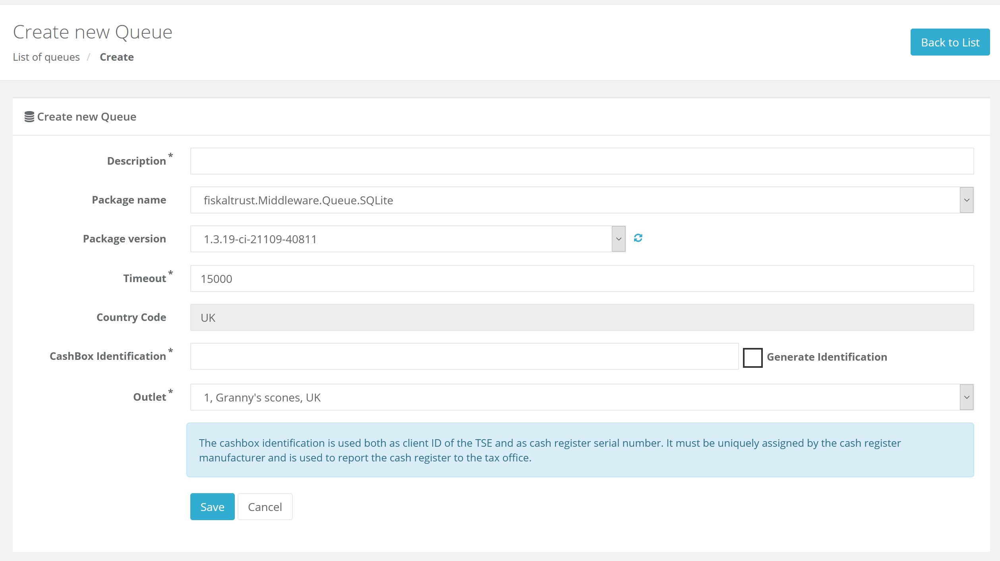

Once you have entered all information, click `Save` and you'll be redirected to the screen where you configure additional technical details, among them the URL (*including the desired communication protocol*) on which the queue should accept IPOS requests from your cash register.

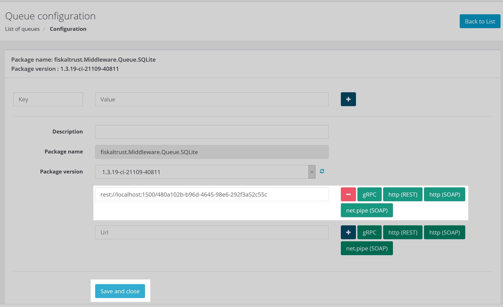

Once you have finished the configuration click `Save and close` and the new queue should be listed on the subsequent screen of all your client's queues.

## 3 - Creating the Cashbox
The cashbox is the central configuration and will combine/connect the queue with the SCU.

### Step 1 - Navigating

Choose `Configuration` - `CashBox` from the left-hand menu.

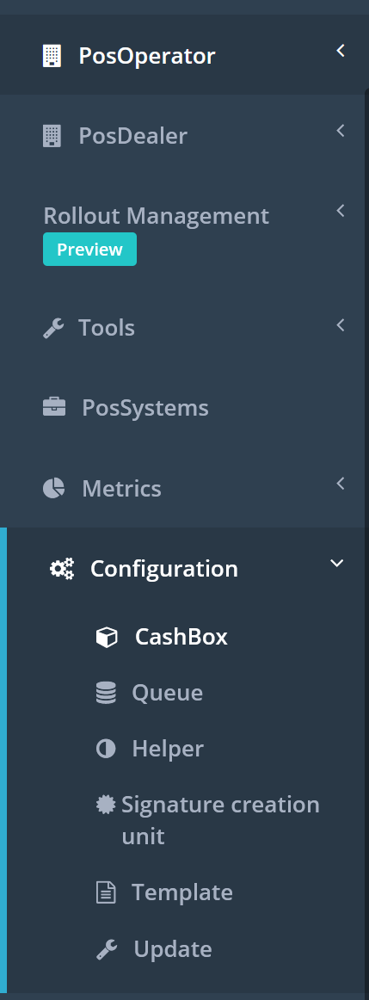

### Step 2 - Selecting the add option

Click the `Add` button.

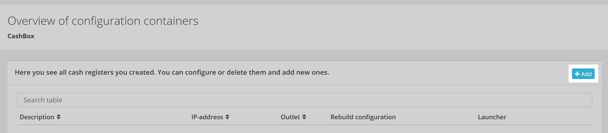

### Step 3 - Entering the details

Enter an appropriate description for your new cashbox and select the outlet in which this queue should be active. Optionally you can also specify a hostname or IP address which will be used as default for any cashbox-external SCUs.

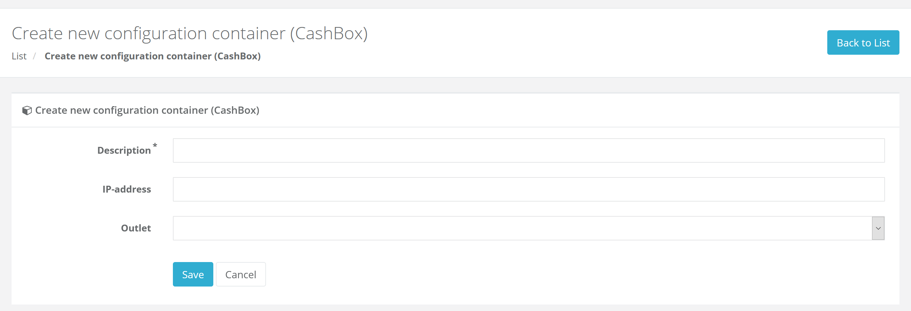

Once you have entered all information, click `Save` and the new cashbox should be listed on the subsequent screen of all your client's cashbox.

### Step 4 - Connecting the components

* Back to the list of your cashboxes, click the `Edit by list` button.

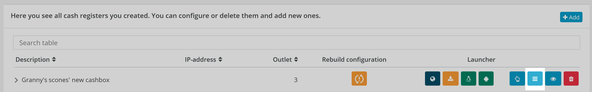

* On the subsequent screen you need to select the previously added queue for this cashbox by ticking the correct row.

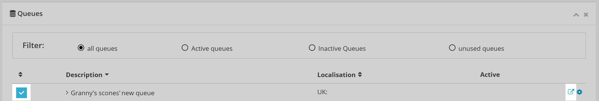

Additionally you need to **connect the queue to the SCU**, for which you click the pop-out icon on the right side. This will open the following screen where you need to select the previously added SCU and click `Save and close`.

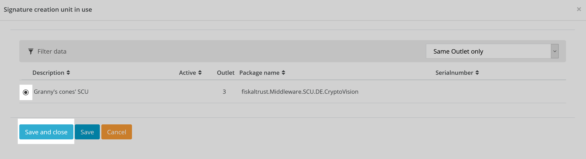

* Now we have configured the queue for the cashbox and connected it to the SCU but we still need to add the SCU to the cashbox as well, which we do by ticking the correct row

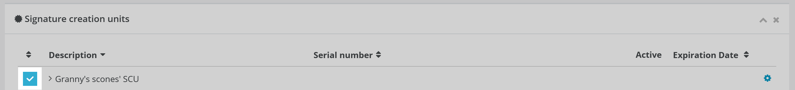

## 4 - Building the cashbox

This is an **important step** which you always have to perform after you created a cashbox, respectively, even after **making any sort of change to its configuration**.

To (re)build a cashbox, navigate to your list of cashboxes and click the cashbox's `Rebuild configuration` button whenever it is highlighted in orange.

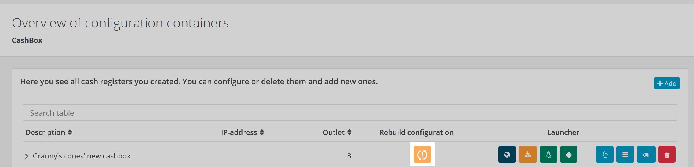

The whole rebuild process is fairly quick and will finish in a few seconds. The moment the rebuild button is greyed out, you'll have an up-to-date configuration.

## Summary

At this point you'll have

* one **SCU**, associated with your SSCD (e.g. in Germany a TSE)
* one **queue**, connected to the SCU
* and one **cashbox**, containing both the SCU and the queue

You can now download the launcher of your choice and deploy the launcher with its cashbox configuration on your cash registers.