# Cash terminals with dedicated queues
This guide walks you through a shared scenario where you have one cashbox with one SCU/TSE and a number of queues, each dedicated to an individual cash terminal of your cash register setup.

This configuration contains a number of traditional queue/SCU setups, where each SCU point to one common shared cloud TSE.

In this tutorial we will set up

1. an SCU
2. a number of queues, each for one cash terminal, all using the same previous SCU
3. a cashbox, containing the SCU and all cashboxes

## 0 - Prerequisites
As dealer please make sure you have used the **surrogate function** first to **enter your client's account and make subsequent changes in that context**.

For this, click `PosOperator` - `Overview` in the left-hand menu, search for your client, and click on your client's name.

*Should it not be possible to click the name, please check the status icon and make sure the client is active (otherwise they might not have completed their account setup yet).*

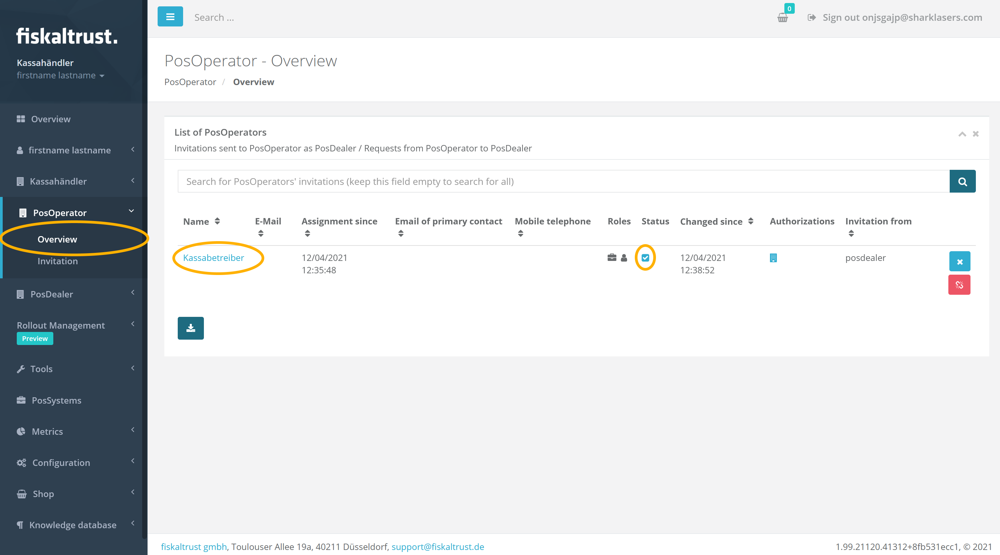

Once you entered your client's account you will notice a red `Switch to your account` button in the top right, which is how you return to your own account and which indicates that you are now successfully operating from within your client's account.

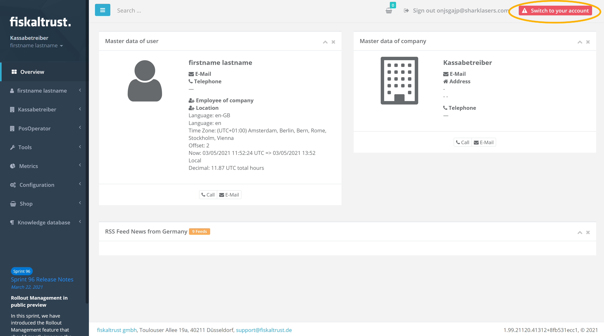

## 1 - Creating the SCU
### Step 1 - Navigating
Choose `Configuration` - `Signatur creation unit` from the left-hand menu.

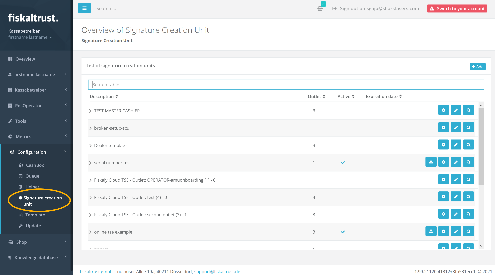

### Step 2 - Selecting the add option

Click the `Add` button.

### Step 3 - Entering the details
Enter a descriptive name for your new SCU in the description field, choose the right package and version applicable to this particular TSE, and select the outlet in which this SCU should be active. When selecting a package the portal will automatically pick the most recent version as default.

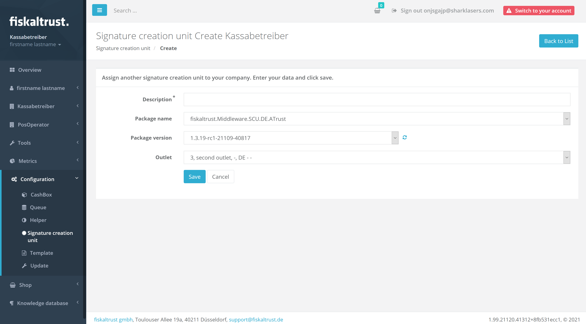

Once you have entered all information, click `Save` and you'll be redirected to where you configure additional technical details. The majority of these settings is TSE specific and you will need to provide the values required by that cloud TSE (e.g. in the case of Fiskaly the TSS ID, the API key, and the API Secret key).
*A full list of available options for each TSE type can be found [here](https://docs.fiskaltrust.cloud/docs/posdealers/rollout-doc/middleware#templating-to-create-cashboxes) under the section `SCU`.*

**Another important part here is the URL** under which the SCU should be accessible to the queue. This includes three elements

1. the **communication protocol**. You can choose between gRPC, REST, SOAP, and net.pipe
2. the **hostname**. Make sure you use an address here which is reachable from all your queues
3. the **URL path** specific to this SCU

Click one of the available protocol types to automatically generate an appropriate URL.

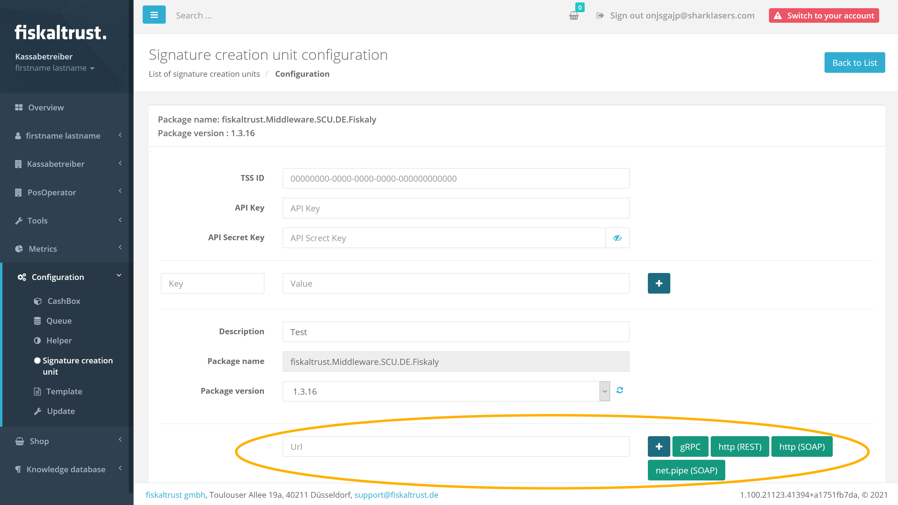

Once you have finished the configuration scroll to the bottom, click `Save and close` and the new SCU should be listed on the subsequent screen of all your client's SCUs.

## 2 - Creating the Queue

### Step 1 - Navigating

Choose `Configuration` - `Queue` from the left-hand menu.

### Step 2 - Selecting the create option

Click the `Create new` button.

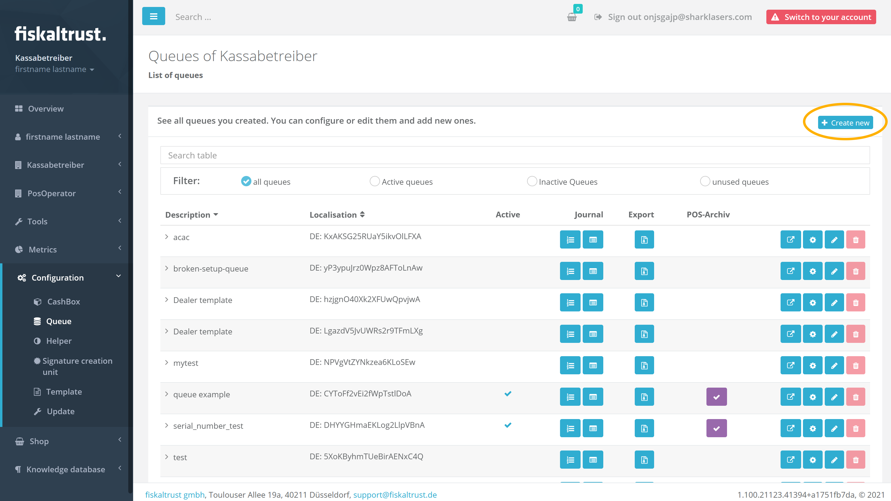

### Step 3 - Entering the details

Enter a descriptive name for your new queue in the description field, choose the right package for the desired backend storage and the applicable version, enter the desired timeout (default 15,000 milliseconds), enter the serial or identification number of your cash register (*or tick `Generate Identification` to let the portal generate a unique number*), and select the outlet in which this queue should be active.

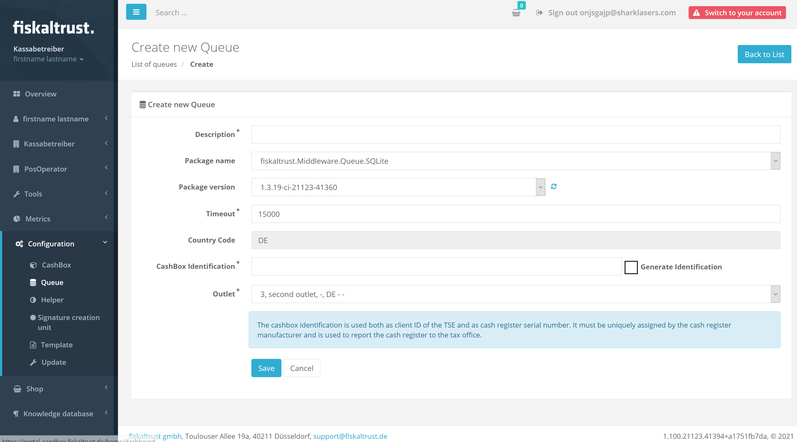

Once you have entered all information, scroll down, click `Save` and you'll be redirected to a screen where you configure additional technical details. The most important part here is the URL under which the queue should accept IPOS requests from your cash register. This URL includes three elements

1. the **communication protocol**. You can choose between gRPC, REST, SOAP, and net.pipe
2. the **hostname** (`localhost` if the queue runs on the same machine as your cash register)
3. the **URL path** specific to this queue and where the cash register will send requests to

Click one of the available protocol types to automatically generate an appropriate URL. You can leave the default values for the URL, unless your setup requires specific settings.

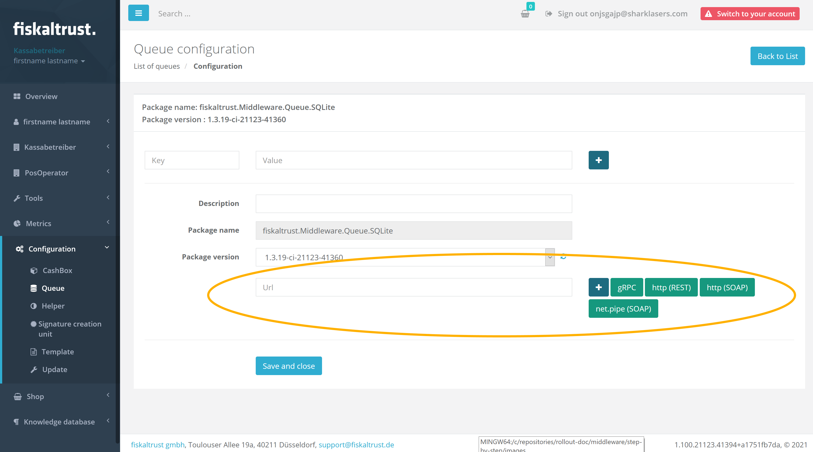

Once you have finished the configuration click `Save and close` and the new queue should be listed on the subsequent screen of all your client's queues.

## 3 - Creating more queues

Repeat task 2 for as many queues as you need for your individual cash terminals.

## 4 - Creating the Cashbox

### Step 1 - Navigating

Choose `Configuration` - `CashBox` from the left-hand menu.

### Step 2 - Selecting the add option

Click the `Add` button.

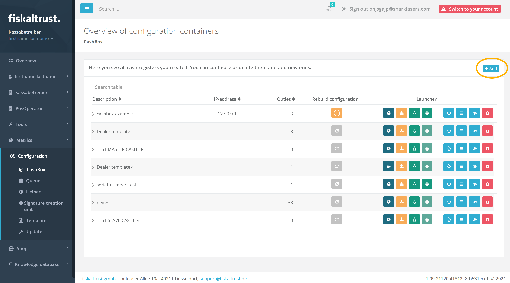

### Step 3 - Entering the details

Enter a descriptive name for your new SCU cashbox in the description field and select the outlet in which this queue should be active.

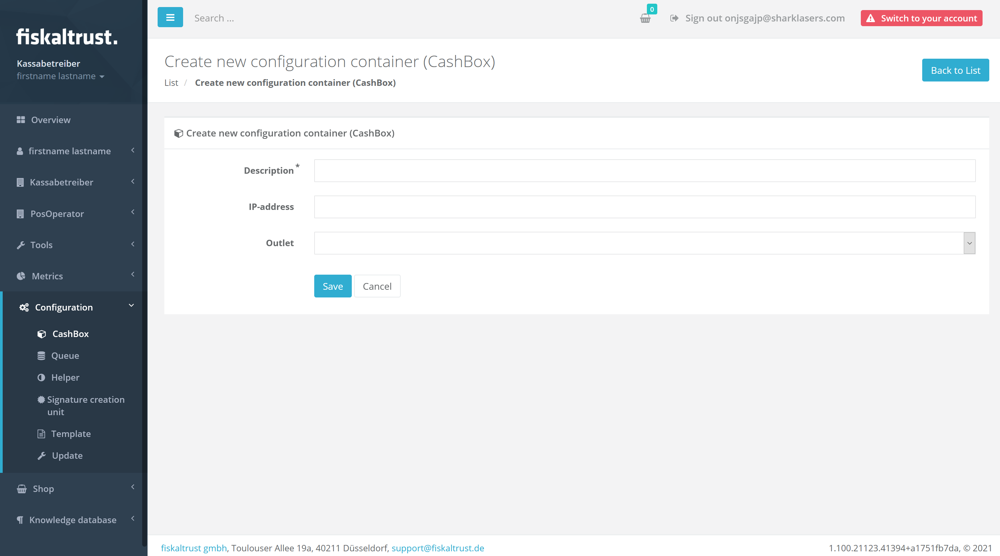

Once you have entered all information, click `Save` and the new cashbox should be listed on the subsequent screen of all your client's cashbox.

### Step 4 - Connecting the components

Back at the list of your cashboxes click the `Edit by list` button.

On the subsequent screen select all previously created queues by ticking their respective rows.

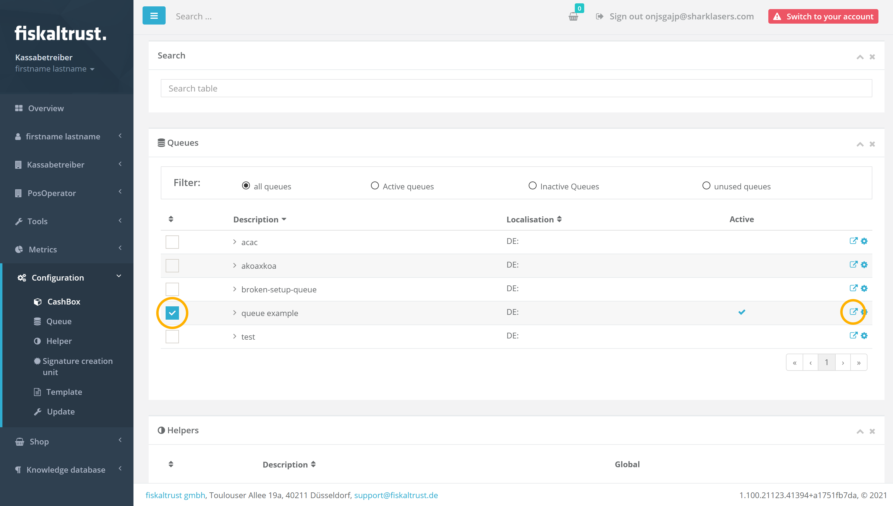

Additionally you'll also need to **connect each queue to the SCU** by clicking the queue's pop-out icon on the right side. This will open the following  screen where you need to select the previously added SCU and click `Save and close`.

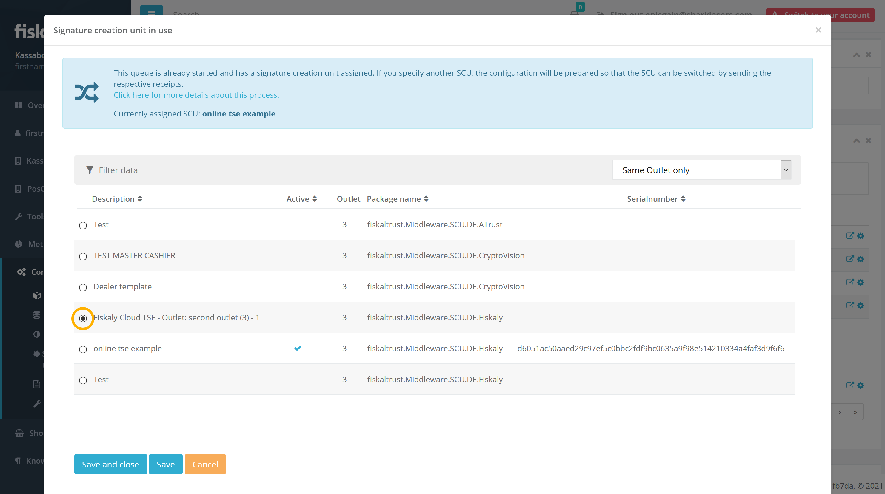

Now we have added and configured all queues to the cashbox and configured them for the SCU, but we still need to add the SCU itself to the cashbox as well, which we do by ticking  the correct row.

Scroll to the bottom of the page and click `Save`.

## 5 - Building the cashbox

This is an **important step** which you always have to perform after you created a cashbox, respectively, even after **making any sort of change to its configuration**.

To (re)build a cashbox, navigate to your list of cashboxes and click the cashbox's `Rebuild configuration` button whenever it is highlighted in orange.

The whole rebuild process is fairly quick and will finish in a few seconds. The moment the rebuild button is greyed out, you'll have an up-to-date configuration.

## Summary

At this point you'll have **one cashbox** with **one SCU** and a **number of queues** all **connected to that SCU**.

You can now download the launcher for your cashbox and deploy it on your cash register. **The important part now is that your cash register will address the right queue depending on the cash terminal from where it received the request.**