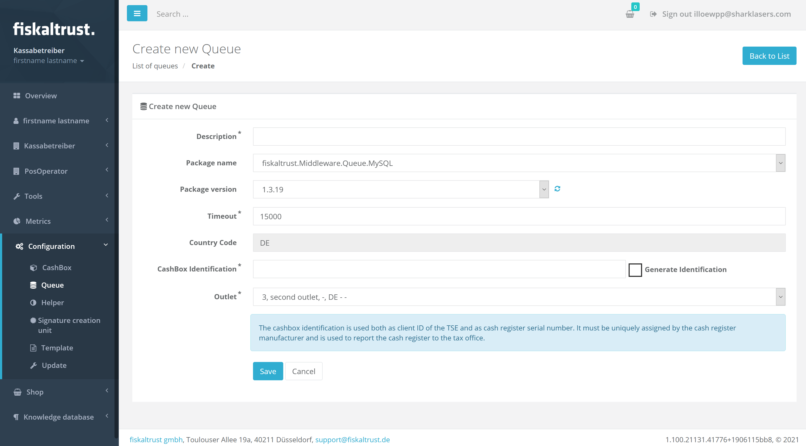
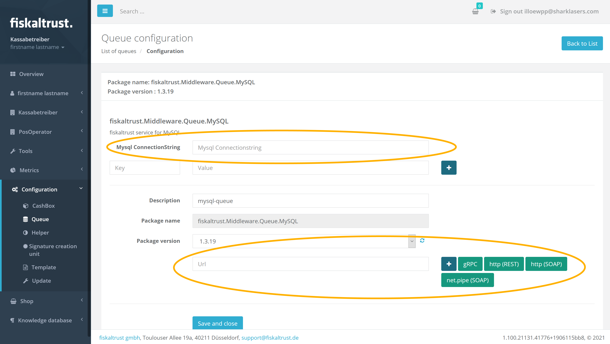

# Central POS in your data centre
This guide walks you through a setup where your outlets use cash terminals and charge through a central cash register located in your data centre. On top of that, the data centre will have a separate CashBox (with its own queue and SCU) for each outlet where the POS will route requests to according to its own logic.


This configuration contains a number of traditional queue/SCU setups, with the most important difference being the data backend *not using an embedded SQLite* database but rather a **MySQL database external to the cashboxes**.

In this tutorial we will first make sure that we have our data backend up and running. Then we will set up

1. an SCU
2. a queue
3. a cashbox, containing the SCU and the cashbox


## 0 - Prerequisites
As dealer please make sure you have used the **surrogate function** first to **enter your client's account and make subsequent changes in that context**.

For this, click `PosOperator` - `Overview` in the left-hand menu, search for your client, and click on your client's name.

*Should it not be possible to click the name, please check the status icon and make sure the client is active (otherwise they might not have completed their account setup yet).*


Once you entered your client's account you will notice a red `Switch to your account` button in the top right, which is how you return to your own account and which indicates that you are now successfully operating from within your client's account.


## 1 - Ensuring database connectivity

As we are not using the embedded SQLite backend in this tutorial please make sure your MySQL instance is up and running and properly configured for the individual queue setups, which we are going to configure now. Please refer to https://dev.mysql.com/doc/refman/8.0/en/ for details on how to set up MySQL.


## 2 - Creating the SCU
### Step 1 - Navigating
Choose `Configuration` - `Signatur creation unit` from the left-hand menu.


### Step 2 - Selecting the add option

Click the `Add` button.


### Step 3 - Entering the details
Enter a descriptive name for your new SCU in the description field, choose the right package and version applicable to this particular TSE, and select the outlet in which this SCU should be active. When selecting a package the fiskaltrust.Portal will automatically pick the most recent version as default.


Once you have entered all information, click `Save` and you'll be redirected to where you configure additional technical details. The majority of these settings is TSE specific and you will need to provide the values required by that cloud TSE (e.g. in the case of fiskaly the TSS ID, the API key, and the API Secret key).
*A full list of available options for each TSE type can be found [here](https://docs.fiskaltrust.cloud/docs/posdealers/rollout-doc/middleware#templating-to-create-cashboxes) under the section `SCU`.*

**Another important part here is the URL** under which the SCU should be accessible to the queue. This includes three elements

1. the **communication protocol**. In a data centre context it is **important to choose `gRPC` here**
2. the **hostname**. Make sure you use an address here which is reachable from all your queues
3. the **URL path** specific to this SCU

Click one of the available protocol types to automatically generate an appropriate URL.


> **It is important that your SCU URL does not use the same port as the URL you plan to use for your queue later on.**


Once you have finished the configuration scroll to the bottom, click `Save and close` and the new SCU should be listed on the subsequent screen of all your client's SCUs.


## 3 - Creating the Queue

### Step 1 - Navigating

Choose `Configuration` - `Queue` from the left-hand menu.


### Step 2 - Selecting the create option

Click the `Create new` button.


### Step 3 - Entering the details

Enter a descriptive name for your new queue in the description field, choose `fiskaltrust.Middleware.Queue.MySQL` as backend storage and the applicable version, enter the desired timeout (default 15,000 milliseconds), enter the serial or identification number of your cash register (*or tick `Generate Identification` to let the fiskaltrust.Portal generate a unique number*), and select the outlet in which this queue should be active.



Once you have entered all information, scroll down, click `Save` and you'll be redirected to a screen where you configure additional technical details.



The most important part here is the MySQL connection string and the URL under which the queue should accept IPOS requests from your cash register.

#### MySQL connection string

Please enter here a valid .NET connection string which contains all the details (e.g. hostname, access credentials) to access your database. A typical connection string would be formatted like the following example

```
Server=myServerAddress;Database=myDataBase;Uid=myUsername;Pwd=myPassword;
```

You'll find more details and examples at https://dev.mysql.com/doc/connector-net/en/connector-net-connections-string.html.

> Please ensure that each queue uses its own unique database, which is not shared with other queues.

#### Queue URL

 This URL includes three elements

1. the **communication protocol**. In a data centre context it is **important to choose `REST` here**
2. the **hostname** (please choose the appropriate hostname here, under which the queue will be accessible to your POS instance)
3. the **URL path** specific to this queue and where the cash register will send requests to

Click one of the available protocol types to automatically generate an appropriate URL.

Once you have finished the configuration click `Save and close` and the new queue should be listed on the subsequent screen of all your client's queues.


> **It is important that your queue URL does not use the same port as the URL you used for your SCU in the previous step.**


## 4 - Creating the CashBox

### Step 1 - Navigating

Choose `Configuration` - `CashBox` from the left-hand menu.


### Step 2 - Selecting the add option

Click the `Add` button.


### Step 3 - Entering the details

Enter a descriptive name for your new SCU CashBox in the description field and select the outlet in which this queue should be active.


Once you have entered all information, click `Save` and the new CashBox should be listed on the subsequent screen of all your client's cashbox.


### Step 4 - Connecting the components

Back at the list of your cashboxes click the `Edit by list` button.


On the subsequent screen select all previously created queues by ticking their respective rows.


Additionally you'll also need to **connect each queue to the SCU** by clicking the queue's pop-out icon on the right side. This will open the following  screen where you need to select the previously added SCU and click `Save and close`.


Now we have added and configured all queues to the CashBox and configured them for the SCU, but we still need to add the SCU itself to the CashBox as well, which we do by ticking  the correct row.


Scroll to the bottom of the page and click `Save`.


## 5 - More outlets

Repeat the tasks 2 to 4 for each additional outlet you'd like to configure.


## 6 - Building the cashbox

This is an **important step** which you always have to perform after you created a cashbox, respectively, even after **making any sort of change to its configuration**.

To (re)build a cashbox, navigate to your list of cashboxes and click the cashbox's `Rebuild configuration` button whenever it is highlighted in orange.


The whole rebuild process is fairly quick and will finish in a few seconds. The moment the rebuild button is greyed out, you'll have an up-to-date configuration.


## Summary

At this point you will have a **number of cashboxes** in your setup (each with its own queue, SCU, and TSE), all of which using the **MySQL database as storage**. The important part now is that your POS-System addresses the right queue whenever it receives a request from one of its cash terminals.
