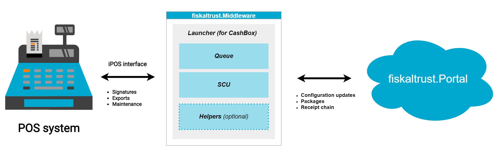

# Architecture

:::info summary

After reading this, you can explain the basic architecture of the fiskaltrust.Middleware, the purpose of a queue, a SSCD, a cashbox and a launcher.

:::

## Introduction

A typical *fiskaltrust* setup consists of a three-tiered system.

1. **Your POS system**
2. **fiskaltrust.Middleware** (running your *fiskaltrust.CashBox*) to provide the service itself
3. **fiskaltrust.Portal** to manage your setup

The following schema provides an overview of how the three tiers interact.

*fiskaltrust.Middleware* is the autonomous service providing the **core signing functionality**. Your POS system connects to the Middleware to **sign and persist its receipts** and the Middleware, in turn, communicates with *fiskaltrust.Portal* to update its own receipt chain and receive any changes you made to its configuration on the portal side.

The following paragraphs will provide you with a brief overview on the major components here.

## Portal

The portal is the central **management hub** where you control all aspects of your *fiskaltrust* account, as well as of the accounts of your associated POS operators (*subject to their authorisation*). This also includes the set-up and management of your Middleware instances (*CashBoxes*).

The portal is also **used by the Middleware** to receive aforementioned *CashBox* configuration, for package management, and to update its receipt chain.

:::info

Each *fiskaltrust* country has its dedicated portal, which can be reached at `https://portal.fiskaltrust.[CCTLD]`.

:::

## CashBox

The CashBox is the main **configuration set** of a Middleware instance and contains all details for the Middleware to successfully run. It is **configured in the portal** and the Middleware will fetch the latest copy on each start.

## Middleware

The Middleware is the main *fiskaltrust* service used *directly* by your POS system. It follows a modular approach and supports a number of components, which can be individually combined in a Middleware instance (*CashBox*) to best fit your custom setup and requirements.

### Launcher

The launcher is the bootstrap component of a Middleware instance. It downloads the **most recent *CashBox* configuration data** from the portal, performs any necessary **maintenance**, and **starts** the configured components.

### Queue

The queue is the **central component** of your *fiskaltrust* setup. It provides the **communication interface** (*e.g. REST*) for your POS system, manages the **receipt datastore**, and handles the signing requests from your POS system.

### SCU

The *Signature Creation Unit* is a supporting component to the queue and is responsible for providing the queue with the actual **legally compliant receipt signature**, as required per national regulations.

:::info

Depending on your market's regulations the SCU might require the use of an additional [SSCD](https://en.wikipedia.org/wiki/Secure_signature_creation_device). These are typically externally attached hardware dongles or, sometimes, also third party SaaS platforms which provide the SCU with the required signature.

:::

### Helpers

Additional to queues and SCUs there can be, based on your particular use case, also additional *helper* components configured. One such helper is **Helipad**, which is deployed by default and handles the Middleware communication with *fiskaltrust.Portal*.