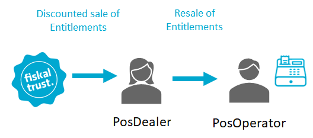

# Business model

:::info summary

After reading this, you can explain how fiskaltrust's partner-based business model works and its advantages for PosCreators, PosDealers and PosOperators.

:::

## Introduction

fiskaltrust is a software company that focuses on developing compliance-as-a-service- and add-on products for cash registers (_POS Systems_) within Europe. Our core product is the fiskaltrust.Middleware. Cash register manufacturers (_PosCreators_) can directly integrate the Middleware to make their POS Systems compliant with local fiscalization laws.

The distribution of fiskaltrust's _products_ and _product bundles_ is done in partnership with cash register dealers (_PosDealers_). Using existing sales structures in the respective countries, PosDealers can offer a product portfolio that considers and fulfills the individual needs of each of their customers (cash register operators or _PosOperators_).

In this model, the PosOperator remains the direct customer of the PosDealer. Attractive volume discounts on fiskaltrust's products enable PosDealers to integrate these products into their portfolio and pricing model on their terms.

Support for the PosOperators is provided by the PosDealer, which in turn is supported by fiskaltrust.

## Advantages for PosDealers

### Products

#### Legally compliant fiscalization from a single source

fiskaltrust acts as an all-in-one fiscalization solution partner. So we offer you as a PosDealer a single point of contact for fiscalization and obtaining solutions for these complex problems.

#### Compliance-as-a-Service

As a customer of our fiscalization solutions, Compliance-as-a-Service means that you as a PosDealer and your PosOperators no longer have to worry about the topic of legally compliant fiscalization. fiskaltrust always ensures up-to-date, lawfully compliant fiscalization in the background - even when legal requirements change. Our goal is to enable our partners to focus on their core business and deliver the best experience to their customers.

#### Product bundles

Our market-specific product bundles include all necessary products and solutions for legally compliant fiscalization. In addition, as described above, they are consistently designed as a service model. Finally, we offer standalone products wherever possible to enable flexible solutions where needed.

#### Flexibility

One of the most significant advantages of fiskaltrust products is their flexibility. Our solutions can be configured flexibly and adapted to existing infrastructure and POS Systems. In addition, PosCreators can configure Middleware packages and configurations as desired - starting from setup for standalone POS Systems to highly interconnected cloud systems.

### Distribution model

#### Development of new customer segments

With fiskaltrust's products covering legally compliant fiscalization as a service model, you as a PosDealer can expand your product portfolio in your core business and address and win new customer segments.

#### Integration into existing product portfolios

Resale by you, the PosDealer, is core to developing fiskaltrust products. fiskaltrust products allow the configuration and installation without the involvement of the PosOperator. In addition, as a PosDealer, you are enabled to bundle and include fiskaltrust's products in your offering thoroughly.

#### Yearly recurrent revenue

fiskaltrust's products use a subscription model. As a result, PosOperators can rest assured that their POS Systems are fiscally compliant for a fixed yearly price without having to build assets in case of changed legal requirements. In addition, this model also creates annually calculable, recurring revenues for the PosDealer.

#### Attractive volume discounts

fiskaltrust offers volume discounts starting from low purchase quantities when signing volume purchase agreements, enabling you as a PosDealer to provide optimum customer support and advice to achieve the highest possible level of customer satisfaction.

### Portal

#### Buying products at a single place

The fiskaltrust.Portal as a central tool for you as a PosDealer enables the purchase of digital and physical products (like hardware signing devices from different manufacturers) in one place.

#### Automation

For large rollouts, fiskaltrust offers a variety of automation options - from creating templates for cash register configurations, bulk imports of customers and outlets, bulk purchases or assignments of products, to the automated rollout of the fiskaltrust.Middleware.

#### Rollout support

You, as a PosDealer, prepare economic and technical prerequisites for a rollout at the end customer remotely. As a result, you mainly use the fiskaltrust.Portal even for the most diverse rollout scenarios. The configuration, purchase and resale of fiskaltrust products thus succeed independently of the on-site commissioning.

#### After-sales support

Even after completed rollouts, functionalities such as mass updates of configurations or middleware updates are available. In addition, how-to guides and documentation templates simplify supporting PosOperators for you as a PosDealer.

## Country-specific products and contact details

While our products all contribute to the common goal of carefree international fiscalization, there are different sub-products and bundles available to ideally solve each market's specific problems. These products are best described on our websites (or in a direct call with one of our Customer Success representatives):

import Tabs from '@theme/Tabs';
import TabItem from '@theme/TabItem';
import SalesAT from '../_markets/at/overview/business-model/_sales.mdx';
import SalesFR from '../_markets/fr/overview/business-model/_sales.mdx';
import SalesDE from '../_markets/de/overview/business-model/_sales.mdx';

<Tabs groupId="market">

  <TabItem value="AT" label="Austria">
    <SalesAT />
  </TabItem>

  <TabItem value="FR" label="France">
    <SalesFR />
  </TabItem>

  <TabItem value="DE" label="Germany">
    <SalesDE />
  </TabItem>

</Tabs>