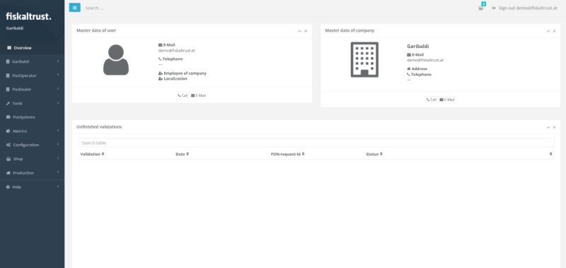

# Management Portal

After reading this, you can explain the tasks performed in the fiskaltrust.Portal.

## Introduction

*fiskaltrust.Portal* is the central **management dashboard** to control all aspects of your *fiskaltrust* account and services. This includes, for example, your account and company data, operator associations, the configuration and rollout of your *fiskaltrust.Middleware* instances, placing orders for products and services, and more.

The following paragraphs will provide you with a brief overview on the general actions and tasks you can perform in the portal.

:::tip surrogating

Please also pay particular attention to the [surrogating](#surrogating) feature, as that will enable you - as a PosDealer - to perform many of those steps for your associated PosOperators as well.

:::

## Account Management

The account section of the portal allows for managing standard settings, such as username and password, as well as **contact and address details** of your account and your company. Here, you configure **employee accounts** and their permissions too.

This section is also where you choose the applicable **company roles** (*PosCreator*, *PosDealer*, or *PosOperator*) for your business and sign the related contract agreements. Your **company outlets** are set up and configured here as well.

## CashBox Maintenance

The *Configuration* section in the portal is the starting point for any *fiskaltrust.CashBox*. This is where you first create and configure the individual **CashBox components** (queue, SCU) and then **assemble** everything into your final CashBox setup. Once your CashBox is ready, the **deployment packages** can also be **downloaded** from here for a number of different target systems.

## Operator Management

The portal is where you manage your operators and **invite** them to *fiskaltrust*. Once they accepted your invitation their **account will be associated** with yours, which (*given their authorisation*) will make [surrogating](#surrogating) possible.

## Surrogating

Surrogating is a key feature of *fiskaltrust.Portal* and enables you to **act on behalf of your operators** within the **scope of their granted authorisation**. This may include **read-only** access, **write** access, and even the permission to sign agreements on their behalf. For *PosDealers* this is an **essential feature** to plan and implement their rollouts.

## Shop

The shop is another key feature of the portal and provides access to all additional **add-on products and services** offered by *fiskaltrust*. For example, the archive service, various product bundles, hardware solutions, and other services. Items can be purchased either individually or as part of pre-configured **rollout plans**.

## Data Management

In the context of the *archive service*, the portal also allows you to **export your data** by various selection criteria and in a number of **different export formats**. Depending on the availability, it is also possible to configure data replication to available **third party service providers**.