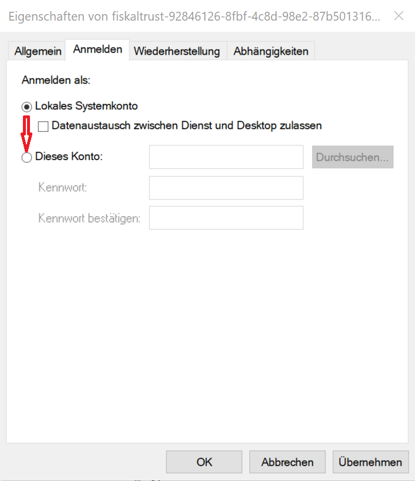

### Technical specialities of the Swissbit Cloud
The Swissbit Cloud TSE has a few technical specialities compared to other fiskaltrust.middleware configurations, which should definitely be taken into account during the rollout. 
1. the Swissbit Cloud TSE installs its own Java environment on the computer. 
2. the Swissbit Cloud TSE is permanently paired to the computer on which it is running.
3. limitations of the product when individually purchased (outside of a carefree bundle)
4. additional firewall requirements for the necessary internet connection.

##### 1. The Swissbit Cloud TSE installs its own Java environment on the computer. 
The Swissbit Cloud TSE installs its own Java environment on the computer.
When installing the Swissbit Cloud TSE, a separate Java environment (called FCC) is set up in the AppData directory of the current user. In the case of fiskaltrust, this installation is carried out the first time Cashbox is started on a computer. This leads to two limitations. First, the installation must be run under the user under which it will be run later. It is not possible to change the user as with other fiskaltrust installations. Secondly, the fiskaltrust.middleware cannot be executed with the local system account. Therefore, the login account of the Windows service must be changed manually after running install-service.cmd BEFORE starting the fiskaltrust.middleware for the first time.

  
The account used must be a local account or a domain account with local administrator rights and it must have access to the Internet. The local system account and the network service account cannot be used. Once an account has been used, it cannot be changed later.

##### 2. The Swissbit Cloud TSE is permanently connected (paired) to the computer on which it is running.
During initialisation, the Swissbit Cloud TSE is permanently paired to the computer on which it is running. After the first communication with the Swissbit Cloud Servers, it can only be run on exactly this computer. With the fiskaltrust.middleware, this happens when the cashbox configured with the Swissbit Cloud TSE is executed for the first time. 
Therefore, in this case, the fiskaltrust.Middleware cannot be run on other devices as a test. The installation is a one-time thing. If something is done incorrectly, the Swissbit Cloud TSE must be purchased again.

##### 3. Limitations of the product when individually purchased (outside of a carefree bundle)

When purchasing a Swissbit Cloud TSE as individual product from fiskaltrust there's a limit of one queue per TSE. This limit does not apply when the TSE is part of a carefree bundle. For details, please refer to the product description LINK.

##### 4. Additional firewall requirements for the necessary internet connection
Please see our [FAQs on firewall settings](https://docs.fiskaltrust.cloud/doc/productdescription-de-doc/for-posdealers/04-after-sales/troubleshooting-firewall.html).
