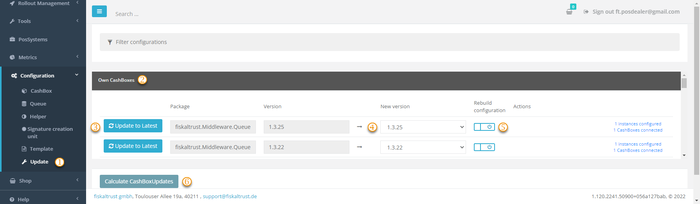

# Updating

:::info summary

After reading this, you can perform updates of the Middleware efficiently.

:::

## Information about updates

We announce the availability of a new update on the fiskaltrust.Portal. Check the [release notes](https://docs.fiskaltrust.cloud/docs/release-notes/) for details about the update and decide if you want to update or not.

import ReactPlayer from "react-player"

<ReactPlayer controls url={require("./media/update-middleware.mp4").default} /> 

## Bulk update CashBoxes

You can update many CashBoxes at the same time using the fiskaltrust.Portal. This bulk update is helpful in case _fiskaltrust_ provides a newer version of a software package and you need to update multiple of your running fiskaltrust.Middleware instances (e.g., you want to replace the package version of the SQLite Queue for all customers). 

In the fiskaltrust.Portal, as a PosDealer, you can call up the view for the mass update of the CashBoxes under 'Configuration' / 'Update'. Here you have the choice to update the CashBoxes of individual accounts or the CashBoxes of all PosOperators assigned to you.

Each CashBox can contain the modules `Queue`, `Helper` and `SCU`. Depending on the module you want to update the package version (e.g., for `fiskaltrust.Middleware.Queue.SQLite` from version `1.3.8` to `1.3.9`) you can specify your update request using the dropdowns. Furthermore, you have the possibility to re-publish the CashBoxes to be updated by activating the `Rebuild Configuration` slider for each update selection. 

| Steps | Description                                                                                                                |
|:----------------------:|-------------------------------------------------------------------------------------------------------------------------------------|
| |Go to `Configuration->Update`.  |
| |Choose your CashBoxes or your PosOperators CashBoxes. |
| |Decide with module and package version you want to update.  |
| |Select the target package version. |
| |Switch the `Rebuild Configuration` slider to on to re-publish the CashBoxes. |
| |Click the `Calculate CashBoxUpdates` button to submit your selection for review. |

The fiskaltrust.Portal checks your entries and provides an overview of which CashBoxes could be changed. 

If you are satisfied with the information, check the overview and press the `Confirm Update` button to execute the update.

:::caution Rebuild Configuration

Do not forget to activate the `Rebuild Configuration` option. Otherwise, you will have to do this manually for each affected CashBox before rolling it out. The configuration change will be available for download for the affected fiskaltrust.Middleware instances.

:::

## Restart the fiskaltrust.Middleware

After updating and rebuilding the CashBoxes in the portal, they are available for download for the fiskaltrust.Middleware instances. However, the fiskaltrust.Middleware instance will download and apply the updated CashBox only after restart. This restart can happen automatically, for example, as part of a nightly reboot of the computer, or can be manually triggered by stopping and restarting the fiskaltrust.Middleware instance.