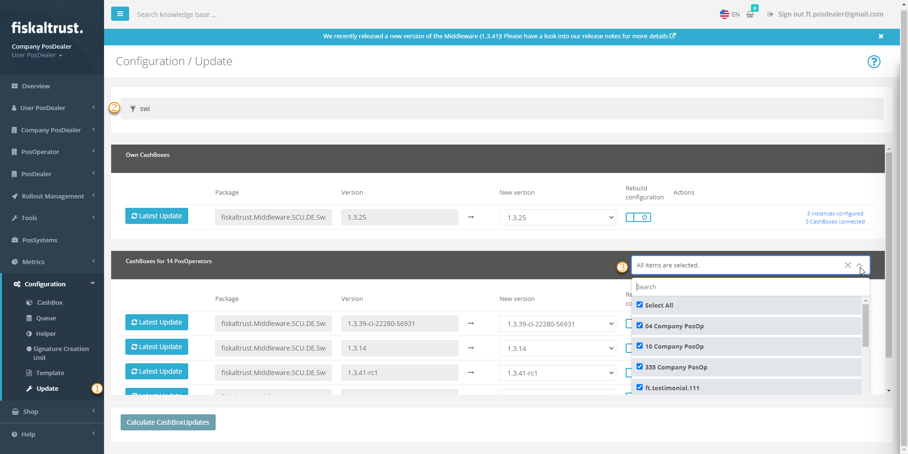
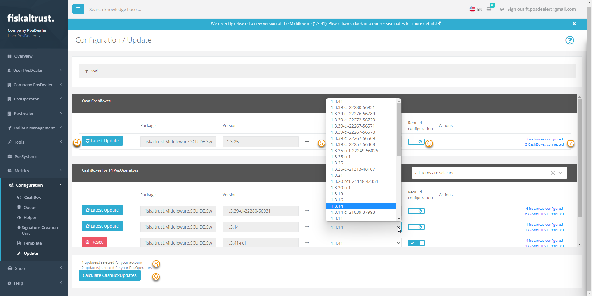
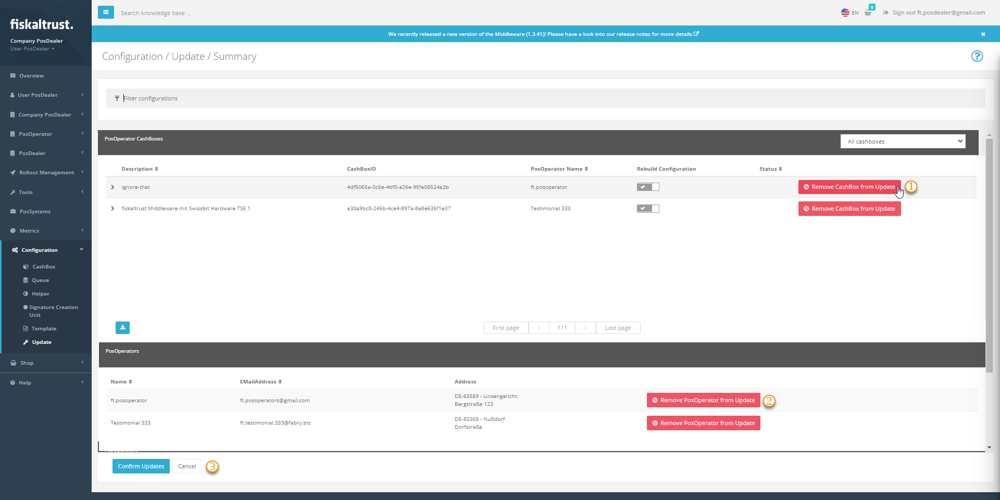
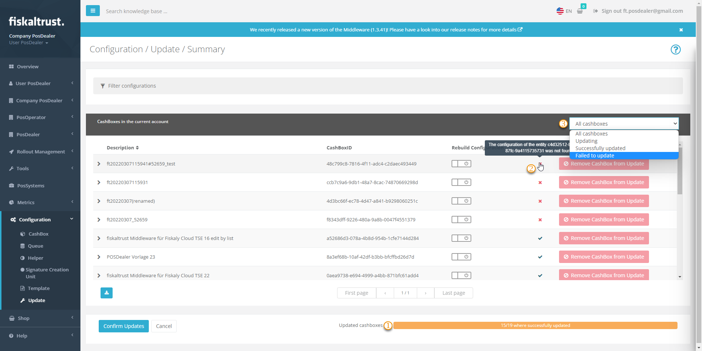

# Updating

:::info summary

After reading this, you can perform updates of the Middleware efficiently.

:::

## Information about updates

We announce the availability of a new update on the fiskaltrust.Portal. Check the [release notes](https://docs.fiskaltrust.cloud/docs/release-notes/) for details about the update and decide whether you want to update.

import ReactPlayer from "react-player"

<ReactPlayer controls url={require("./media/bulk-update-22-11-22.mp4").default} /> 

## Bulk update CashBoxes

You can update many CashBoxes at the same time using the fiskaltrust.Portal. This bulk update is helpful if _fiskaltrust_ provides a newer software package version and you need to update multiple of your running fiskaltrust.Middleware instances (e.g., you want to replace the package version of the SQLite Queue for all customers). 

You can find the view for a mass update of CashBoxes in the fiskaltrust.Portal under `Configuration` / `Update`. Here you can update your CashBoxes. In addition, as a PosDealer, you can further filter specifically for packages or versions of CashBoxes for PosOperators assigned to you. You can also select a single or multiple of your PosOperators. 

Each CashBox can contain the Queue, Helper and SCU modules. Then, via drop-down menus, you select individually, depending on the module, the desired package version (e.g., for `fiskaltrust.Middleware.Queue.SQLite` from version `1.3.8` to `1.3.9`) and via slider also the update of the configuration. 
The `Latest Update` button generally assigns the latest available version; the configuration update is thereby preset.  

| Steps | Description                                                                                                                |
|:----------------------:|-------------------------------------------------------------------------------------------------------------------------------------|
| |Go to `Configuration` / `Update`.  |
| |Reduce the number of records with filter criteria such as package or version name |
| |You can further limit the number of records by selecting individual PosOperators. |

After selecting the desired records, choose between updating to the latest version and new configuration or manually selecting the version and rebuilding the chosen configuration.

| Steps | Description                                                                                                                |
|:----------------------:|-------------------------------------------------------------------------------------------------------------------------------------|
| |`Latest Update` offers you the latest version and updates the configuration.  |
| |Alternatively, you can use the drop-down menu `New version` to assign an individually desired verison.|
| | When selecting a version individually, specify that the new configuration should be updated. Otherwise, perform this update manually for each CashBox (`Configuration` / `CashBox` / `Rebuild CashBox`). |
| |Note the information about the number of connected CashBoxes. |
| |Note the information about the number of updates for your or your PosOperators accounts. |
| |Click the `Calculate CashBoxUpdates` button to submit your selection for review. |

:::caution Rebuild Configuration

Remember to activate the Rebuild Configuration option. Otherwise, you will have to do this manually for each affected CashBox before rolling it out or restarting it.

:::

You will find an overview of the calculation result for CashBoxUpdates at `Configuration`/ `Update`/ `Summary`. 

| Steps | Description                                                                                                                |
|:----------------------:|-------------------------------------------------------------------------------------------------------------------------------------|
| |With `Remove CashBox from Update`, you reduce the selection to the desired CashBoxes.|
| |With `Remove PosOperator from Update`, you reduce the selection to the desired PosOperators. |
| |If you are satisfied with the selection, press the `Confirm Update` button to execute the update. |

## Control updates

After executing the updates, `Configuration`/ `Update`/ `Summary` offers you an overview.

| Steps | Description                                                                                                                |
|:----------------------:|-------------------------------------------------------------------------------------------------------------------------------------|
| |A success bar shows the progress during the update process with percentages. After completion, the success of all updates is displayed in green; yellow indicates failed updates.|
| |Details of successful or failed updates are displayed in the `Status` column by the icons. |
| |For further investigation, you can `filter` CashBoxes by the results of the updates.|

## Restart the fiskaltrust.Middleware

After updating and rebuilding the CashBoxes in the fiskltrust.Portal, they are available for download for the fiskaltrust.Middleware instances. However, the fiskaltrust.Middleware instance will download and apply the updated CashBox only after restart. This restart can happen automatically, for example, as part of a nightly reboot of the computer, or can be manually triggered by stopping and restarting the fiskaltrust.Middleware instance.