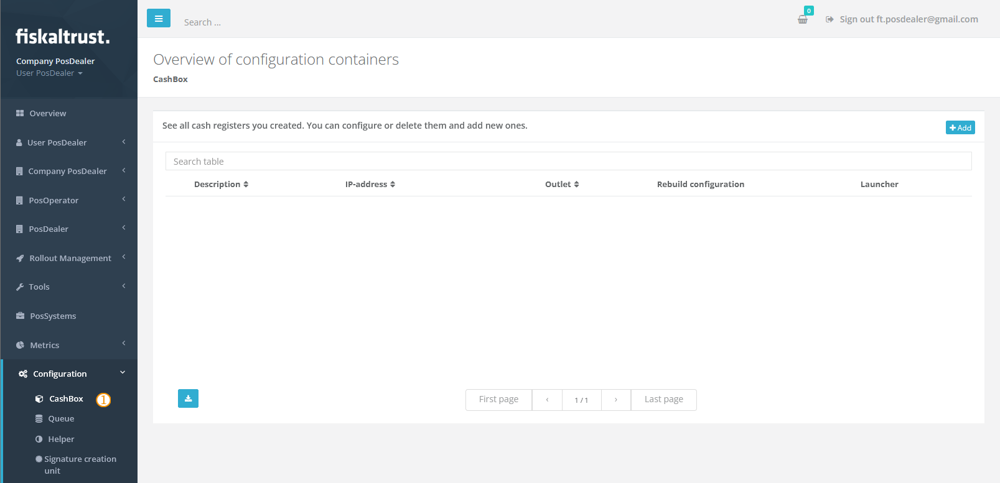

# Cashbox

:::info summary

After reading this, you can explain how the Middleware uses the CashBox configuration and create one.

:::

## Introduction

A CashBox is the basic configuration set of a Middleware setup. It contains the details of all its components (e.g. queue, SCU) and their relation to each other (e.g. a queue connected to an SCU).

The CashBox is primarily configured in the portal and then rolled out as part of the Middleware deployment.


## CashBox ID & Access Token

The CashBox ID and the access token are two crucial parameters of each CashBox and are used for authentication against the portal services. For example, the Middleware itself uses them to fetch its configuration. You'll also use them in the context of templating.

You can access the ID and the token of each CashBox under its respective entry on the [`Configuration` / `CashBox`](#cashbox-maintenance-portal) screen.

:::caution

The CashBox ID is not strictly confidential data and will often be requested by fiskaltrust.Support to identify the CashBox and provide technical assistance.

As for the access token, please **do not share the access token** with third parties and treat it like a password.

:::


## CashBox instance (Middleware)

From the Middleware's point of view, a CashBox is a [JSON](https://en.wikipedia.org/wiki/JSON) file it fetched from the portal during its start phase (or as part of the deployment package, in case of an offline setup). That file contains the **whole configuration information** for this particular Middleware instance. This includes all the components it is supposed to provide and their own configuration data.

The format of the file follows a standard JSON syntax, with the top-level fields being

* `ftCashBoxId` - Specifying the **ID** of the CashBox
* `ftSignaturCreationDevices` - The list of **SCUs** configured for the CashBox
* `ftQueues` - The list of **queues** configured for the CashBox
* `helpers` - The list of **helpers** configured for the CashBox
* `TimeStamp` - The time when the CashBox configuration was **last updated**


:::info

Unless the Middleware is configured for offline mode, it will try to compare its CashBox configuration against the portal's on each start and apply pending changes to the configuration. Please make sure the relevant _fiskaltrust_ hosts are reachable for your Middleware, otherwise it won't be able to download the latest CashBox data.

Please see [Network Requirements](network-requirements.md) for details.

:::


#### Configuration Sample

The following sample is a trimmed down CashBox skeleton outlining the overall structure.

```json
{
	"ftCashBoxId": "00000000-0000-0000-0000-000000000000",
	"ftSignaturCreationDevices": [{
		"Id": "00000000-0000-0000-0000-000000000000",
		"Package": "fiskaltrust.package",
		"Version": "1.0",
		"Configuration": {},
		"Url": ["grpc://localhost:1201"]
	}],
	"ftQueues": [{
		"Id": "00000000-0000-0000-0000-000000000000",
		"Package": "fiskaltrust.package",
		"Version": "1.0",
		"Configuration": {
			"init_ftQueue": [{
				"ftQueueId": "00000000-0000-0000-0000-000000000000",
				"ftCashBoxId": "00000000-0000-0000-0000-000000000000",
				"ftCurrentRow": 0,
				"ftQueuedRow": 0
			}],
			"init_ftCashBox": {
				"ftCashBoxId": "00000000-0000-0000-0000-000000000000",
				"TimeStamp": 0
			},
			"init_ftSignaturCreationUnitAT": [],
			"init_ftSignaturCreationUnitFR": [],
			"init_ftSignaturCreationUnitDE": []
		},
		"Url": ["rest://localhost:1200/fiskaltrust"]
	}],
	"helpers": [{
		"Id": "00000000-0000-0000-0000-000000000000",
		"Package": "fiskaltrust.package",
		"Version": "1.0",
		"Configuration": {},
		"Url": []
	}],
	"TimeStamp": 0
}
```


## CashBox maintenance (Portal)

The portal is the starting point for each CashBox. There, you create and maintain all your CashBoxes.

To get an overview of your CashBoxes, open the portal and go to `Configuration` / `CashBox` ().




### Creating a CashBox

There are a couple of ways of adding a new CashBox to your portal account. You can do so manually, by simply creating a new CashBox entry and configuring its components by hand. Another way would be to use pre-existing CashBox templates and have the new CashBox being created based on a template. One more way to get a new CashBox is also to use rollout management, which also uses templates in the background.


#### Manually

Perform the following steps to create a new CashBox by hand.

1. Open the portal and navigate to the list of CashBoxes.
2. Click the `Add` button in the top right.
3. On the new screen, provide the basic CashBox information.
   - A description for the CashBox.
   - The outlet for which the CashBox should be active.
4. Click `Save`.

Subsequently, you will be redirected back to the list of CashBoxes, where your new CashBox should now appear. Please see [Configuring a CashBox](#configuring-a-cashbox) for details on how to configure your new CashBox and add the desired components.


#### With templates and rollout plans

CashBox templates are customisable blueprints for CashBoxes and, depending on their configuration, come with several components already preconfigured.

CashBoxes can be created with templates in the context of shop and API templating, as well as part of a technical rollout. Please see the chapters [Templates](../rollout-automation/templates.md) and [Rollout Plans](../../buy-resell/rollout-plans.md) for more information on these topics.

:::caution 🇦🇹 austria

Rollout plans are not yet available on the Austrian portal.

:::


### Configuring a CashBox

A CashBox alone does not do much. It needs to be configured with all the service components you eventually want to run as part of that CashBox, such as queues or SCUs.

CashBoxes, created in an automated fashion, will already have their preconfigured components by default. However, in case you would like to make changes to that configuration, or you created the CashBox by hand, you can always edit its component configuration afterwards. To do so, click either the `Drag & Drop to edit` button () to configure via drag drop, or the `Edit by list` button () to select the components from a list view.


### Rebuilding

Please make sure to rebuild your CashBox, whenever it has the rebuild icon () active. Any changes to the configuration are only applied once that step was performed. After a successful rebuild, you can proceed to download the deployment package or restart the any already deployed instance.


:::caution restart

Please do note, once you have deployed your CashBox, any changes to its configuration will only take effect after a restart of your Middleware instance. It also needs to be able to [reach thefiskaltrust.Portal services](network-requirements.md) and it must **not** be configured for [offline mode](configuration.md#parameters).

:::