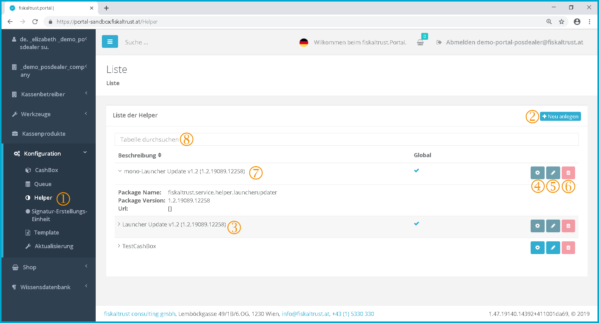
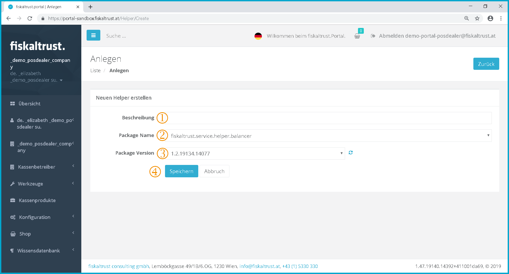
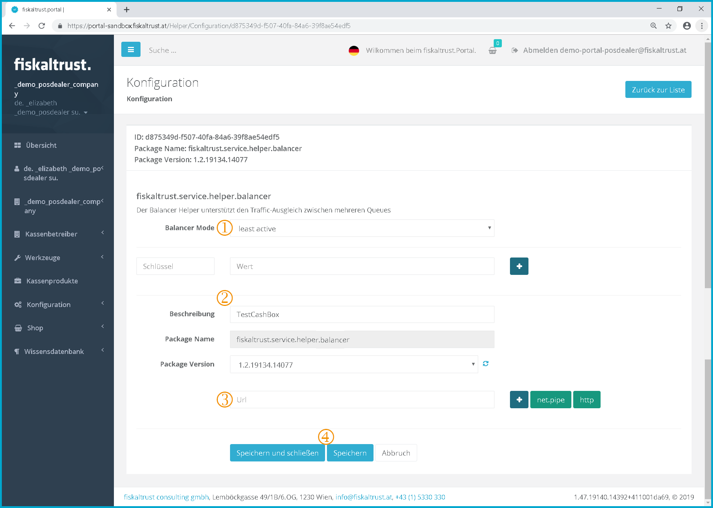

# Helper

:::info summary

After reading this, you can explain what a Helper does and how to use it.

:::

## Introduction

Helpers can extend the [CashBox](cashbox.md) with further functionality or change existing functionality. They are created in the portal like any other technical component and assigned to a CashBox. 

## Types of Helpers

The type and number of helpers can vary depending on national laws and/or needed functionallity of POS-Systems.
Depending on the type of helper, it might be necessary to enter values for parameters or add additional parameters.

### HelipadHelper
One example of a helper that is available in all countries is the HelipadHelper, which is responsible for uploading data from the local queue to our cloud. This helper is automatically added to each cashbox with the default settings in the background and has not to be added by the user. It is possible though, to create your own HelipadHelper to change the upload behaviour. 

:::caution Troubleshooting only

Do not change the standard behaviour without reason! Usually there should be no need to change the behaviour of the Helipad. Only when you are facing troubles with your uploads (like upload failures, constant retries or problems with the standard 1000 receipt upload size), changing the upload behaviour with an own HelipadHelper might help solving the issue.

:::

Available Parameters:
interval : the upload interval in seconds. default is 5 minutes.
maxrecordcount : the maximum number of items the helper tries to upload, default is 1000 (e.g. 1000 queueitems, 1000 journals, ...). this value is slowly reduced when uploading fails a few times, and increased again up to the max when it succeeds
recordcountjournalde: same as maxrecordcount, but specifically for the JournalDE table (which contains the tar files). this value is "fixed", in case the TAR upload fails it may be a good idea to set this to 1 (we're considering making this the default value in the future anyway for this specific entity)

### Country specific Helpers

import HelperAT from '../../_markets/at/technical-operations/middleware/overview/_helper.mdx';
import HelperFR from '../../_markets/fr/technical-operations/middleware/overview/_helper.mdx';
import HelperDE from '../../_markets/de/technical-operations/middleware/overview/_helper.mdx';

<Tabs groupId="market">

  <TabItem value="AT" label="Austria">
    <HelperAT />
  </TabItem>

  <TabItem value="FR" label="France">
    <HelperFR />
  </TabItem>

  <TabItem value="DE" label="Germany">
    <HelperDE />
  </TabItem>

</Tabs>

## Overview Helper

Overview Helper

 To get to the Helper configuration, click on the menu item "*Helper*".

 Click on \[Create new\] to go to the page for creating a new helper.

 The name of the helper is displayed here.

 By clicking on , the basic settings and package configuration for individual use of the Helper in the cash register can be called up again.

 By clicking on , things like the description, package name and version of the helper may be edited.

 Click on  to delete the helper. However, the button to delete the helper is currently inactive for legal reasons, so no helper can currently be deleted.

 A brief overview of the data for the selected helper is displayed here.

 With the help of the search function, a helper can be searched for by entering any parameter in the search field.

## Add a helper

Add Helper

 In this field the name of the helper can be changed.

 Here you can use the dropdown menu to select from the various package versions.

 The package version can also be selected using a dropdown menu. These can be updated by clicking on .

 Click on \[Save\] to save the Helper configuration.

## Configure a Helper

Helper - Configuration

 Here you can choose between the individual modes "least active" and "round robin" in the dropdown menu.

 In this field the name of the helper can be changed.

 Here you can create a URL for your Helper. By clicking on  you get a URL, which is suitable for local use without internet connection, because no firewall settings are required.

 By clicking on the  button, the system generates a URL for you with which the POS system can access the helper. You can rename the URL yourself. This can look like this: http://localhost:1200/Helperfiskaltrust

Click on \[Save\] to save the Helper configuration.