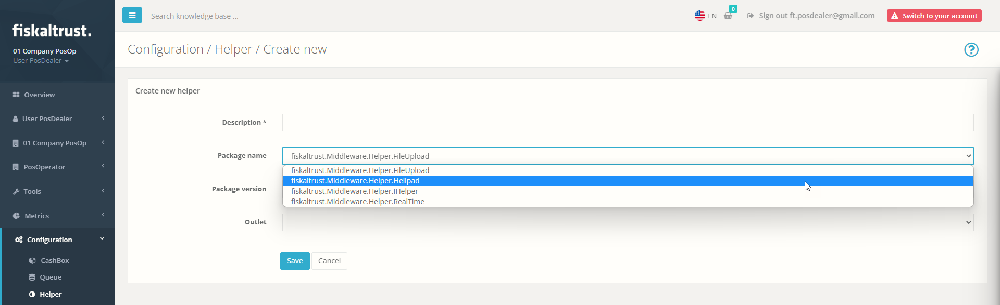
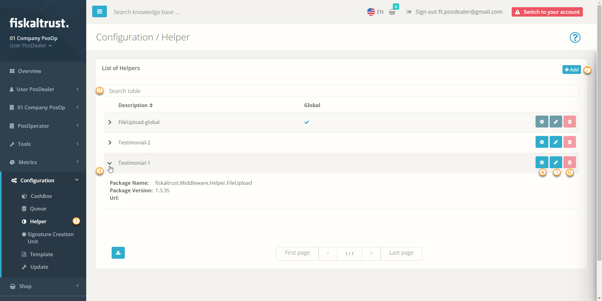
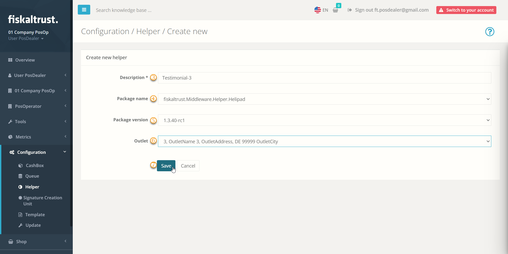
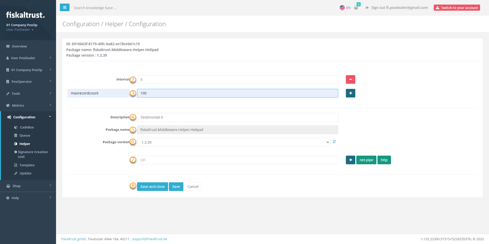
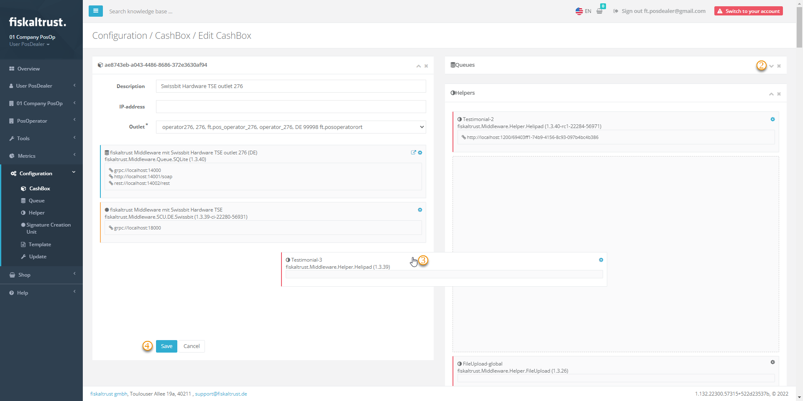

# Helper

:::info summary

After reading this, you can explain what a Helper does and how to use it.

:::

## Introduction

Helpers can extend your CashBoxes with further functionality or change existing functionality. They are created in the portal like any other technical component and assigned to a CashBox.

## Types of Helpers

The type and number of Helpers can vary depending on national laws and the needed functionality of POS-Systems.
Depending on the Helper type, it might be necessary to enter values for parameters or add additional parameters.

### POS-API Helper (Example)

The POS-API Helper speeds up the smooth process from the creation of a document to its display at the PosOperator.

#### Introduction

The POS-API Helper is responsible and required for the upload of the receipt data from the local queue (fiskaltrust.Middleware) to the digital receipt endpoint (fiskaltrust). The POS-API Helper is available in all countries and works similarly to a proxy. This helper is part of the default background settings and is assigned to each CashBox. Once added, the POS-API Helper helps to switch to a direct upload behavior of digital receipts within seconds. Without the POS-API Helper, receipt uploads can take up to five minutes - during which time the digital receipt cannot be displayed on consumers' digital devices.

:::caution Please note:

**POS-API Helper** is just an alternative with less features compared to our **POS-API** which gives you extended functionality and full compliance in Austria. Please choose carefully if the POS-API Helper is suitable for your POS software environment.
We recommend the **POS-API Helper** for the **fiskaltrust InStore app**,  
otherwise only for test installations.

:::

If you have further questions or need clarification, please contact your fiskaltrust representative or reach out to fiskaltrust's Customer Success Team ([AT](mailto:support@fiskaltrust.at) / [DE](mailto:support@fiskaltrust.de) / [FR](mailto:support@fiskaltrust.fr)).

#### Preparation and deployment

###### Preparation Queue

| steps | description                                                                                                                |
|:----------------------:|-------------------------------------------------------------------------------------------------------------------------------------|
| |Login to your fiskaltrust.Portal account.  |
| |Navigate to `Configuration` / `Queue`.|
| |Select `Configure Queue`.  |
| |Copy the URLs to your local machine, these are required for CashBox configuration.  |
| |**For all countries**: Change port to the next free port (+1) and.  |
|...|a.	if **no suffix** exists after the port: add the suffix "/ _placeholder__queue" to the URL (_placeholder_ can be freely chosen)|
|...|b.	b.	if a suffix already exists: add the suffix "_queue" to the URL|
| |**Germany & France only:** Change `grpc port` to the next free port and add the suffix "/I_queue" to the URL (_placeholder_ can be chosen freely). If the designated port is free there is no need to go up to the next free port..  |
| |`Save` your changes.  |

###### Preparation Helper

| steps | description                                                                                                                |
|:----------------------:|-------------------------------------------------------------------------------------------------------------------------------------|
| |Switch to `Configuration` / `Helper`.  |
| |Select `+Create new helper`.|
| |Add a `description`.  |
| |Select `fiskaltrust.service.helper.posapi` as `Package name`.  |
| |Select the latest `Package version`.  |
| |Select the `Outlet` of the desired CashBox|
| |`Save` the new configuration.  |
| |Select `Configure helper`.  |
| |**For all Countries**: 	Insert the previously saved Queue URLs to the Helper URLs and add the suffix / _placeholder_ to the URL (analogue to your naming in `Preparation Queue`).|
| |**Germany & France only**: Add also `GRPC URL` with next free port and add the suffix / _placeholder_ to the URL (analogue to the naming in `Preparation Queue`).|
| |`Save` your changes.  |

##### Preparation CashBox 
| steps | description                                                                                                                |
|:----------------------:|-------------------------------------------------------------------------------------------------------------------------------------|
| |Switch to `Configuration` / `CashBox`.  |
| |Select the desired CashBox and `Edit by list`.|
| |Navigate to `Helpers`.  |
| |Activate the `POS-API Helper`|
| |`Save` your configuration.  |
| |Select the `Rebuild` of your configuration|

##### Restart

**Restart** the fiskaltrust.Middleware to apply your changes. 

### HelipadHelper (Example)

One example of a Helper available in all countries is the HelipadHelper, which is responsible for uploading data from the local queue to the cloud receipt archive. This Helper belongs to the default settings in the background and is assigned to each CashBox. Therefore, it has not to be added by the user. 
You can add your own HelipadHelper to change the upload behavior. 

:::caution Troubleshooting only

Do **not change the standard behavior** without reason! Usually, there should be no need to change the behavior of the Helipad. However, when you face troubles with your uploads (like upload failures, constant retries or problems with the standard 1000 receipt upload size), changing the upload behavior with your own HelipadHelper might help solve the issue.

:::

#### HelipadHelper (Available Parameters)

##### interval

Use the **interval** parameter to set the length in seconds for the upload interval. The default value is 300 seconds (5 minutes).

##### maxrecordcount

With **maxrecordcount**, you define the maximum number of objects for which the upload will be attempted. The default value is 1000 (e.g., 1000 queue items, 1000 journals, ...). 
If the upload fails a few times, gradually reduce the maximum number. If the upload succeeds again, increase the value step by step up to the maximum possible value.

##### recordcountjournalde

With **recordcountjournalde**, you define the same as _maxrecordcount_, the maximum number of files for an attempted upload. But this parameter is valid specifically for the JournalDE table, which contains the tar files.
In case the TAR upload fails, set this value to 1.

### Country specific Helpers

import Tabs from '@theme/Tabs';
import TabItem from '@theme/TabItem';

import HelperAT from '../../_markets/at/technical-operations/middleware/overview/_Helper.mdx';
import HelperFR from '../../_markets/fr/technical-operations/middleware/overview/_Helper.mdx';
import HelperDE from '../../_markets/de/technical-operations/middleware/overview/_Helper.mdx';

<Tabs groupId="market">

  <TabItem value="AT" label="Austria">
    <HelperAT />
  </TabItem>

  <TabItem value="FR" label="France">
    <HelperFR />
  </TabItem>

  <TabItem value="DE" label="Germany">
    <HelperDE />
  </TabItem>

</Tabs>

## Overview Helper

| steps | description                                                                                                                |
|:----------------------:|-------------------------------------------------------------------------------------------------------------------------------------|
| |Choose `Configuration`/ `Helper` to get to the Helper configuration.  |
| |To reduce the displayed search results, you can enter your desired search terms. |
| |With the arrow symbol, you can display a brief overview of the data for the selected Helper. |
| |By clicking on `Configuration`, the basic settings and package configuration for individual use of the Helper in the cash register can be called up again. |
| |By clicking on `Edit`, you may edit things like the description, package name and version of the Helper. |
| | The button `Trash` is inactive: _You cannot delete Helpers as they are an integral part of the CashBox and contain important audit data that you must preserve._ |
| |Click on `+Add` for creating a new Helper. |
See [Add a Helper](#add-a-helper) below for further details.

## Add a Helper

Note that the following figures and steps are exemplary. Other Helpers may require further configuration. 

| steps | description                                                                                                                |
|:----------------------:|-------------------------------------------------------------------------------------------------------------------------------------|
|...| _Choose `Configuration`/ `Helper` to get to the Helper configuration._  |
|...| _Click on `+Add` for creating a new Helper._ |
| |Add or edit a **name** for your Helper at  `Description`. |
| |Make a selection from the different **Helper types** using the drop-down menu at `Package name`. Note that this selection **cannot be changed later**. |
| |Select one `Package version` using the drop-down menu.|
| | You can select one of the available outlets with the drop-down menu. |
| |`Save` your changes; note that **you cannot change your selection of Helper type** at `Package name`. |

See **Configure a Helper** below for further details of configuration.

## Configure a Helper

| steps | description                                                                                                                |
|:----------------------:|-------------------------------------------------------------------------------------------------------------------------------------|
|...| _Choose `Configuration`/ `Helper`, search for the desired Helper and press `Configuration`._  |
|| Enter a parameter like the one mentioned above at `Key` and add a `Value`. |
|| Select  to add another parameter and enter `Key` and `Value`. |
| |Edit the **name** for your Helper in  `Description`. |
| |You cannot change your formerly selected Helper type using the drop-down menu at **Package name**. |
| |You can select another `Package version`. If the desired version is unavailable, use `Reload package version` to refresh the drop-down menu.|
| |You can enter a URL for your Helper. With `net.pipe`you get a URL suitable for local use without an internet connection because no firewall settings are required. With `http`, the system generates a URL for you with which the POS-System can access the Helper. You can rename the URL yourself. For example, this URL can look like this: http://localhost:1200/fiskaltrust.Helper. |
| |`Save` your changes or use `Save and close` to return to `Configuration`/ `Helper`. |

## Assign a Helper

| steps | description                                                                                                                |
|:----------------------:|-------------------------------------------------------------------------------------------------------------------------------------|
|...| _Change to `Configuration`/ `CashBox`, search for the desired CashBox and press `Drag & Drop to Edit`._  |
|| Reduce the List of `Queues` |
|| Drag the desired Helper from the menu on the right side and drop it on the left side  |
| |Save your changes with `Save`. |
|... |Back at `Configuration`/ `CashBox`, select `Rebuild configuration` and restart the CashBox. Note the [formerly mentioned warning](helper.md#HelipadHelper-(Description))|
