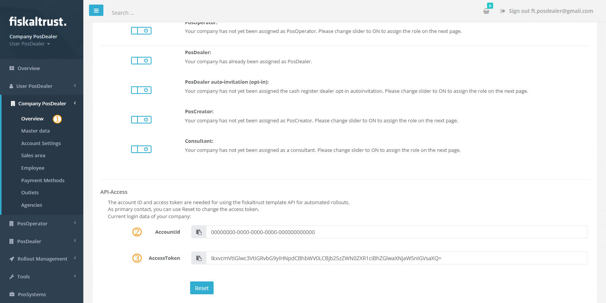

# API Templating

:::info summary

After reading this, you can use the API to rollout templates.

:::

## Introduction

In addition to the other ways of creating a CashBox, mentioned in the previous chapters, fiskaltrust also provides a REST API for a fully automated solution to set up CashBoxes. This API takes a generic template, relevant CashBox parameters and variables, and creates a new CashBox based on this information. Contrary to [templates used in the shop](shop-templating.md), these templates do not need to be pre-configured, but the content is sent directly with the API request.

The response to a successful request will include the [ID and access token](../middleware/cashbox.md#cashbox-id--access-token) of the newly created CashBox, which will allow for an immediate rollout of a launcher instance with these values.


## Using the API

### Prerequisites

In order to run a request successfully against the template API, you'll need at least the following three items.

* Your account ID
* Your account's access token
* The desired template



The ID and the access token can be obtained from your portal's company overview at `[COMPANYNAME]` / `Overview` (). There, you'll find at the bottom of the page your account ID () and the access token () for the authentication against the API.

Additionally to the ID and access token, you will also need the template itself, encoded for a JSON string, as you will have to include it in the API request.


### Sending a request

The API is available at `https://helipad.fiskaltrust.cloud/api/configuration` and takes a `POST` request, along with the account ID, the account's access token (*please note the distinction to a CashBox's access token*), and the template in question as JSON string.

:::tip sandbox

As mentioned in the chapter [Sandbox](../../getting-started/sandbox.md#how-to-reach-the-sandbox), there's also a `-sandbox` suffixed version available at `https://helipad-sandbox.fiskaltrust.cloud/api/configuration`.

:::

The account ID and access token serve as authentication information and are passed as part of the request headers `accountid` and `accesstoken`. In addition to these two headers, the request also requires the template itself as JSON string in the request body.

A very basic request example would be

```http
POST /api/configuration HTTP/1.1
Host: helipad.fiskaltrust.cloud
Content-Length: 167
Content-Type: application/json
accountid: ACCOUNT_ID
accesstoken: ACCOUNT_ACCESS_TOKEN

"{\r\n    \"ftCashBoxId\": \"|[cashbox_id]|\",\r\n    \"ftSignaturCreationDevices\": [],\r\n    \"ftQueues\": [],\r\n    \"helpers\": [],\r\n    \"TimeStamp\": 0\r\n}"
```


This is a standard HTTP `POST` request and you can use any HTTP library (e.g. [Jodd HTTP](https://http.jodd.org) for Java-based applications) or HTTP client (e.g. [curl](https://curl.se/) or [PowerShell's Invoke-WebRequest](https://docs.microsoft.com/powershell/module/microsoft.powershell.utility/invoke-webrequest)) of your choice to send the request.

**curl**


```shell
curl.exe -X POST -H "Content-Type: application/json" -H "accountid: ACCOUNT_ID" -H "accesstoken: ACCOUNT_ACCESS_TOKEN" -d 'ESCAPED_TEMPLATE' https://helipad.fiskaltrust.cloud/api/configuration
```

**Invoke-WebRequest**

```powershell
$headers = @{ accountid = "ACCOUNT_ID"; accesstoken = "ACCOUNT_ACCESS_TOKEN" }
Invoke-WebRequest -Uri https://helipad.fiskaltrust.cloud/api/configuration -Method Post -Headers $headers -Body "ESCAPED_TEMPLATE" -ContentType "application/json"
```

:::caution

If using the shell, please pay particular attention that all applicable characters are appropriately escaped. [Shell escaping](#shell-escaping) has more details on that.

:::


### Escaping the template

Please do note, the API does **not** expect a plain JSON object in the request body but rather a (properly escaped) JSON string. For example, the following template


```json
{
    "ftCashBoxId": "|[cashbox_id]|",
    "ftSignaturCreationDevices": [],
    "ftQueues": [],
    "helpers": [],
    "TimeStamp": 0
}
```

should be encoded as follows


```json
"{\r\n    \"ftCashBoxId\": \"|[cashbox_id]|\",\r\n    \"ftSignaturCreationDevices\": [],\r\n    \"ftQueues\": [],\r\n    \"helpers\": [],\r\n    \"TimeStamp\": 0\r\n}"
```

In short, a traditional JSON string with quotation marks escaped with a slash, new-lines with their respective escaped counterparts, as well as any other applicable characters.


:::tip

You can escape the template with a [number of tools](https://search.brave.com/search?q=escape+json), such as e.g. [freeformatter.com](https://www.freeformatter.com/json-escape.html) or [codebeautify.org](https://codebeautify.org/json-escape-unescape). If you are comfortable with the browser console (F12), you can also use [JSON.stringify()](https://developer.mozilla.org/docs/Web/JavaScript/Reference/Global_Objects/JSON/stringify) to escape the template object. **Please make sure the string is enclosed by quotation marks.**

:::

#### Shell escaping

If you run the request from the command line, please also pay attention to escape sequences required by your shell. For example, PowerShell requires `` ` `` as escape character for quotations marks and using `Invoke-WebRequest` for the template object `{"ftCashBoxId": "|[cashbox_id]|"}` would require the following parameter

```
-Body "`"{\`"ftCashBoxId\`": \`"|[cashbox_id]|\`"}`""
```


### Customising parameters

Similarly to [Custom variables](#custom-variables), you can customise many of the parameters of the individual CashBox components by providing their values in the query string.

#### Queue parameters

There are three main queue parameters, each using a **zero-based** index to indicate the queue of the template, where you'd like to apply the value.

| Parameter                          | Description                                                  |
| ---------------------------------- | ------------------------------------------------------------ |
| `queue{0-n}_cashboxidentification` | The identifier of the CashBox.                               |
| `queue{0-n}_countrycode`           | [ISO 3166-1 alpha-2](https://en.wikipedia.org/wiki/ISO_3166-1_alpha-2) country code of the queue. |
| `queue{0-n}_timeout`               | Specifying a millisecond value for the timeout of the queue. |

For example, to specify a timeout value of 10,000 milliseconds for the **second** queue in your template, you'd append `queue1_timeout=10000` to the query string of your HTTP call.


#### Market-specfic parameters

import Tabs from '@theme/Tabs';
import TabItem from '@theme/TabItem';
import ParametersAT from '../../_markets/at/technical-operations/rollout-automation/api-templating/_parameters.mdx';
import ParametersFR from '../../_markets/fr/technical-operations/rollout-automation/api-templating/_parameters.mdx';
import ParametersDE from '../../_markets/de/technical-operations/rollout-automation/api-templating/_parameters.mdx';

<Tabs groupId="market">

  <TabItem value="AT" label="Austria">
    <ParametersAT />
  </TabItem>

  <TabItem value="FR" label="France">
    <ParametersFR />
  </TabItem>

  <TabItem value="DE" label="Germany">
    <ParametersDE />
  </TabItem>

</Tabs>


### Handling the response & provisioning the CashBox

If the response you receive indicates a status code `200`, the request properly went through and a new CashBox should have been created. In this case, the response body will contain a JSON object (not an escaped JSON string) with the details of that new CashBox.

```
{
	"cashBoxId": "",
	"accessToken": "",
	"configuration": ""
}
```

| Field           | Description                                                  |
| --------------- | ------------------------------------------------------------ |
| `cashBoxId`     | The ID of the created CashBox.                               |
| `accessToken`   | The access token of the created CashBox.                     |
| `configuration` | The configuration object of the new CashBox, as escaped JSON string and based on the provided template. |

Here, in particular `cashBoxId` and `accessToken` are interesting, as they allow you to automatically provision the CashBox. To do that, please deploy a vanilla [Launcher](../middleware/launcher.md) instance on the destination system and set its [CashBox ID and Access Token parameters](../middleware/configuration.md) to the values you received in the response.


## Custom variables

In addition to the readily available [system variables](templates.md#pre-defined-system-variables), you can also use custom variables in your templates. These variables follow the same syntax as system variables (i.e. `|[variable_name]|`) and they can be used throughout your template.

Their values are passed via the [query string](https://en.wikipedia.org/wiki/Query_string) of the request to the template API and each custom variable used in your template needs to have a corresponding value in the query string. For example, if you used the variable `|[my_variable]|`, you'd need to pass its value in the call to the API by adding `my_variable` to the query string.

```
https://helipad.fiskaltrust.cloud/api/configuration?my_variable=desired_value
```

The call above will substitute all occurrences of `|[my_variable]|` with `desired_value`.

:::tip overriding [system variables](templates.md#pre-defined-system-variables)

The query string can also be used to override values of system variables. Any value passed in this way will have precedence over the default value.

:::


## Demo with Postman

Postman is a popular HTTP client and is often used to run REST requests manually. You can use it to try out and fine-tune your own requests to the template API.

To download Postman, please go to https://www.postman.com/downloads and select the appropriate package for your system. fiskaltrust also provides a [Postman collection](../../assets/template_postman.zip) with pre-configured request settings, which you can import and use as foundation to customise your own API requests.


import ReactPlayer from "react-player"

<ReactPlayer controls url={require("./media/postman_example.mp4").default} /><br />

|               Step               | Description                                                  |
| :------------------------------: | ------------------------------------------------------------ |
|   | Import the [demo collection](../../assets/template_postman.zip) into your Postman instance. |
|   | Create a duplicate entry of the Sandbox environment.         |
|   | Open the newly created entry.                                |
|   | In the `Params` tab, specify the desired Sandbox outlet ID and CashBox description. |
|   | In the `Headers` tab, specify your Sandbox [account ID and Access Token](#prerequisites). |
|   | In the portal, fetch a demo template from `Configuration` / `Template`. |
|   | [Escape](#escaping-the-template) the template.               |
|   | In the `Body` tab, add the escaped template as JSON string.  |
|   | Send the request using the `Send` button.                    |
|  | Check if the response indicated a successful request.        |
|  | In the portal, verify if the CashBox was properly created under `Configuration` / `CashBox`. |