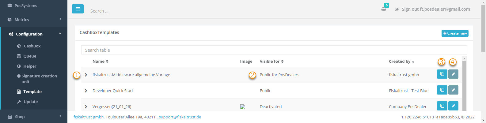
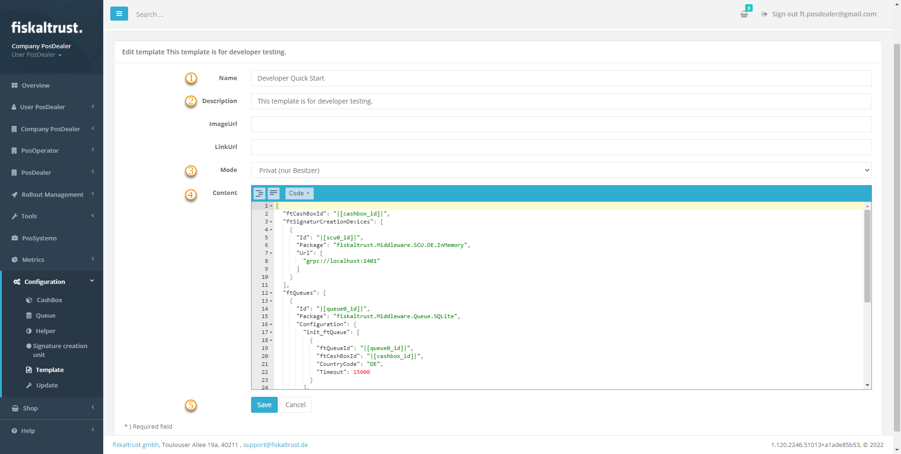

# Shop Templating

:::info summary

After reading this, you can create and use templates in the portal.

:::

Instead of manually creating and configuring a CashBox, you can use a template to create many similar CashBoxes. The fiskaltrust.Portal offers a graphical user interface to create, clone, edit and roll out templates.

## Create & Edit Template

At `Configuration-> Template`, you can see the existing templates, clone and edit them and create new ones.

| elements | description                                                                                                                |
|:----------------------:|-------------------------------------------------------------------------------------------------------------------------------------|
| |Expand a template to get more detailed information.  |
| |Templates are visible for different scopes of users: Private (owner only), Deactivated (not visible in shop), Public for (your) PosOperators, Public for (your) PosDealers. |
| |You can clone an existing template.  |
| |Edit an existing template. |
| |Create a new template. |

When you create or edit a template, you must fill out the following form.

| elements | description                                                                                                                |
|:----------------------:|-------------------------------------------------------------------------------------------------------------------------------------|
| |Meaningfull name for the template. |
| |More detailed description to understand the purpose and content of the template. An image (e.g. product image) and link url for further information can be assinged.  |
| |Mode sets the visibility of the template: Private (owner only), Deactivated (not visible in shop),Public for (your) PosOperators, Public for (your) PosDealers.   |
| |The JSON content of the template. |
| |Save the template before leaving the page. |

## Create CashBox from Shop Template

You can create CashBoxes from templates at `Shop-> Products` by buying them like a regular product (see chapter [Shop](../../buy-resell/shop.md)). 
Please make sure to [surrogate](../../getting-started/operator-onboarding/surrogating.md) into the right PosOperator and select the correct Outlet in the Shop before adding the template into the shopping cart. Your Checkout creates the CashBox.

:::info Required Products

Some templates require buying a product before the derived CashBoxes will be fully operational. It would help if you mentioned this prerequisite in the description of the template. If so, place the required product into the shopping cart **before** adding the template to the cart.

:::