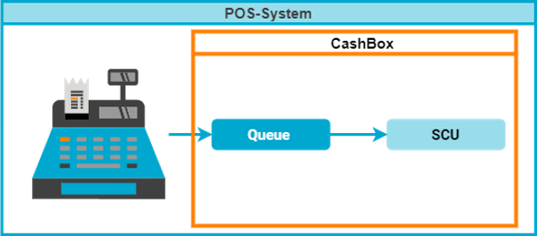
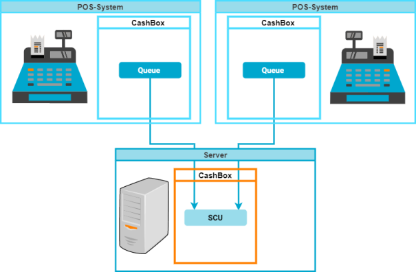
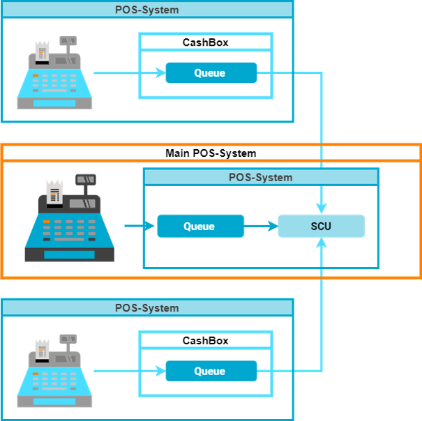
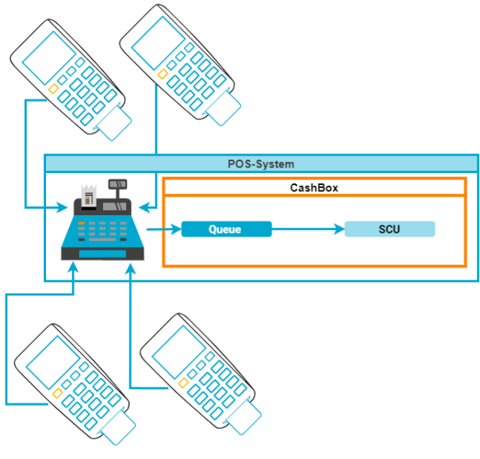
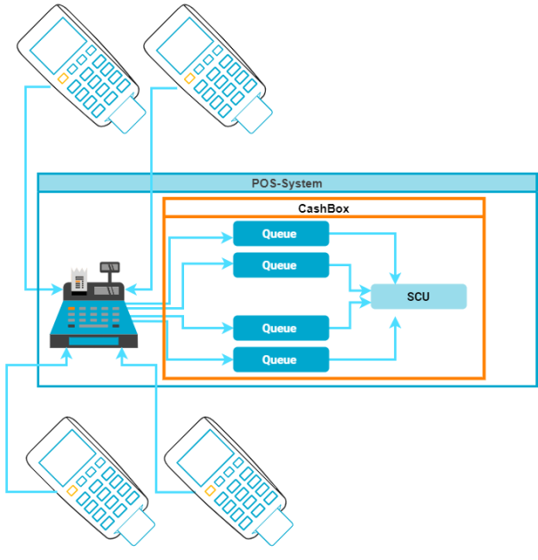
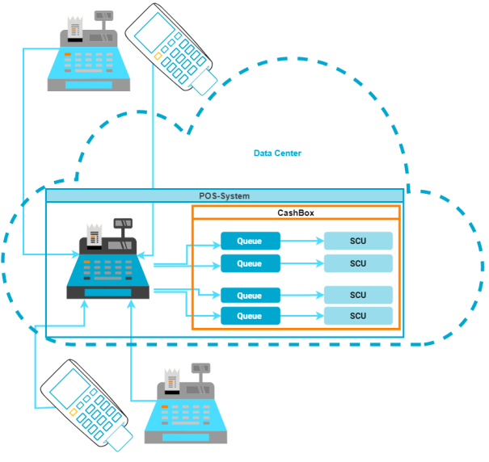

:::info summary

After reading this, you can design the setup of the Middleware components and decide how to integrate them into your environment.

:::

## Introduction
The scenarios in this general part will not cover all the aspects that you, as a PosDealer, can cover with fiskaltrust.Middleware and our products. 
Please check the country-specific notes for further details. Unfortunately, not all scenarios are available in every country due to technical or legal reasons.

### Explanation of terms and graphics

Please not our [terminology](../../faq/terms.md) for the terms used in our application and this documentation.

Pros and cons describe the scenarios. The term _POS-System fails_ means that the Queue will switch into a failure mode but is still operational until you, as a PosDealer or PosOperator, restore the connection by a zero receipt. 

|                      Image                      | Description         |                      Image                       | Description           |
| :---------------------------------------------: | :------------------ | :----------------------------------------------: | :-------------------- |
|  | **Main POS-System** |  | Subsidiary POS-System |
|      | Terminal, Handheld  |             | Server                |

## Scenarios

:::tip

Please note that SCUs are _virtual_ entities in countries where software-only signing is permitted. _Virtual_ entities mean that in these countries, the Queue uses the SCUs certificate directly to sign receipts. Therefore, you do not have to host SCUs separately. 

This solution currently only applies to the **Middleware for France**, so you as a french PosDealer can ignore the SCU parts in the diagrams below.

:::

### One SCU for each POS-System
A single SCU for each POS-System is the simplest - and often the most reliable - architectural approach and works best for independent, standalone POS systems.

| Facts | Description                                                          |
| :---: | :------------------------------------------------------------------- |
|   ➕   | The most simple architectural setup                                  |
|   ➕   | High performance, because you find all components located on the same device   |
|   ➖   | Consistent costs for each POS-System without regard to varying needs |

### One SCU at server for multiple POS-Systems
By placing a single SCU in a separate CashBox and providing access from multiple queues/POS systems, you create a more efficient solution for networked systems, such as in stores with various POS systems and an on-site back office.

| Facts | Description                                                                                     |
| :---: | :---------------------------------------------------------------------------------------------- |
|   ➕   | If a hardware signature element is required, you can use a central component and achieve lower costs. |
|   ➕   | Low complexity, as there are few components used                                                |
|   ➖   | Possibly higher installation effort, as networking also needs to be set up and maintained        |
|   ➖   | The server or the signing devices can be a performance or reliability bottleneck                |

### One SCU in the main POS-System, used by other POS-Systems
Hosting a single SCU for multiple Queues in the CashBox of the _main_ POS-System can be a more efficient solution for interconnected systems, e.g., in stores with various POS-Systems and **no** on-site back office.

| Facts | Description                                                                                     |
| :---: | :---------------------------------------------------------------------------------------------- |
|   ➕   | If a hardware signature element is required, you can use a central hardware component and achieve lower costs. |
|   ➕   | No back-office or server required                                                               |
|   ➖   | Lower reliability - if the main POS-System is out of operation, all POS-Systems fail            |
|   ➖   | The main POS-System or the signing devices can be a performance or reliability bottleneck       |

### Multiple POS-Systems share one external signature service
In scenarios where the external signing provider supports multi-place usage, this architecture helps reducing local network complexity by re-using the same SCU in multiple CashBoxes.

| Facts | Description                                                                                                                       |
| :---: | :-------------------------------------------------------------------------------------------------------------------------------- |
|   ➕   | Low complexity, as there are few components used                                                                                  |
|   ➕   | By sharing the signing entity, you achieve lower costs.                                                      |
|   ➖   | The cloud signing device can be a performance or reliability bottleneck (as, e.g., requests are handled sequentially by cloud TSSs) |

#### Country-specific limitations
This setup is only available with cloud signing in Austria or when using the fiskaly cloud TSS in Germany.

### Main POS-System for multiple Terminals
You, as a PosDealer, can recommend this scenario for interconnected POS-Systems. In this scenario, you connect terminals with no standalone functionality to a central system.

| Facts | Description                                                                             |
| :---: | :-------------------------------------------------------------------------------------- |
|   ➕   | Flexibility with changing workloads by adjusting the number of terminals                |
|   ➕   | High spatial flexibility of the employees                                               |
|   ➕   | Lower costs because no server is needed                                                |
|   ➖   | Low reliability - if the SCU is out of operation, all Terminals and the POS-System fail |
|   ➖   | Main POS-System can be a performance bottleneck                                         |

:::tip

Our partners' experiences showed that in exceptional cases, terminals become defective and, e.g., repeatedly send a broken receipt. If this happens at a high frequency, this could block the shared Queue. You can achieve excellent reliability by creating a separate queue for each terminal and, e.g., hosting all of them in the same CasHbox, as shown in the following diagram.

:::

### Hosted Middleware & custom data centers
This scenario works best in centralized system architectures. You connect many POS Systems or terminals to the hosted version of the fiskaltrust.Middleware. The Middleware operates either in the user's data center or our cloud (as a SaaS product called SignatureCloud). In countries where remote signing is allowed (Austria and France), this is the recommended solution, as it does not require any locally installed Middleware instances.

| Facts | Description                                                                                                         |
| :---: | :------------------------------------------------------------------------------------------------------------------ |
|   ➕   | Flexibility with changing workloads by adjusting the number of terminals                                            |
|   ➕   | High spatial flexibility of the employees                                                                           |
|   ➕   | Data is stored securely in the operational cloud environment or datacenter                                          |
|   ➕   | Lower operating costs and effort, as no local hardware is needed                                                  |
|   ➖   | Depending on country-specific conditions, the reliability may be limited if the remote POS-System is unavailable. |
|   ➖   | Permanent, stable internet connection is required                                                                   |
