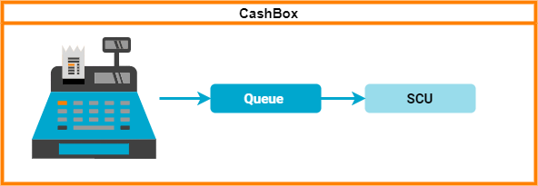
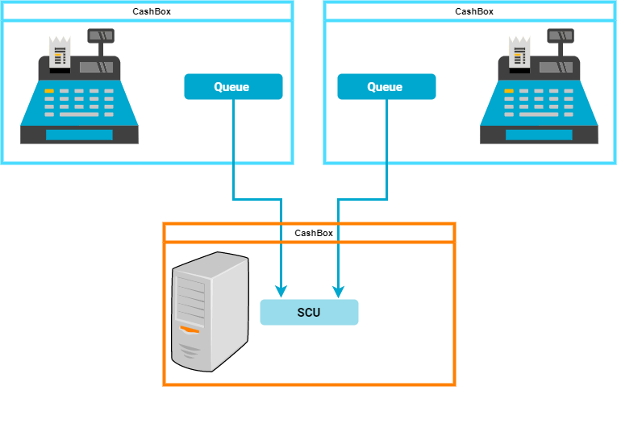
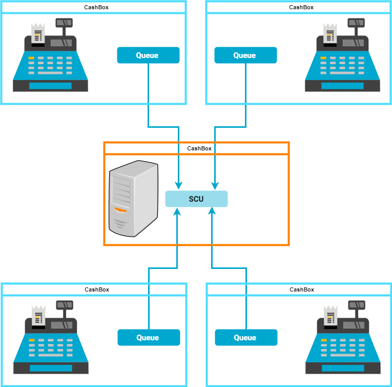
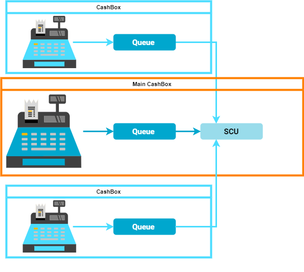
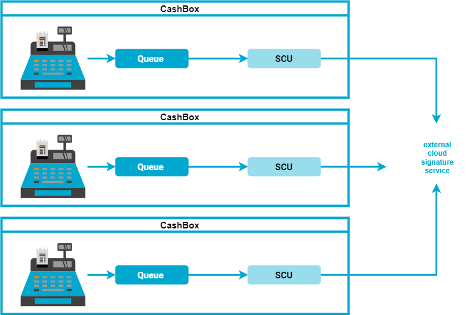
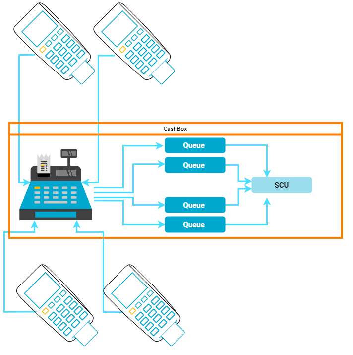
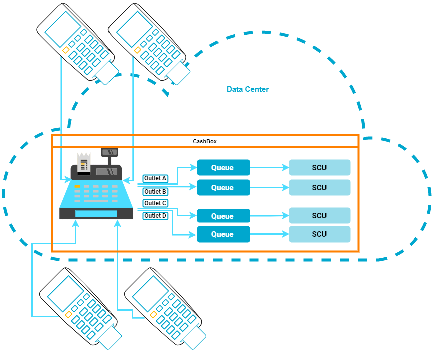

## Scenarios

After reading this, you can design the setup of the Middleware components and decide how to integrate them into your environment.

## Explanation

The scenarios in this general part will not cover all the aspects, that can be covered with fiskaltrust.Middleware and our specified products.  
Have a look at the country-specific information for further details.

### basics

* An outlet need its own SCU. Outlets can be shared spaces, queues not
* A queue must be reported to the fiscal authority 
* Each queue requires the connection to a specific SCU
* Each queue and each SCU must be in the operational environment of a POSOperator

:::tip health check

health check is done only while configuration, do not change

::: 

### Explanation of terms

| image | description  |
|:----------------------:|:----------------------:|
| |Cash register or **Pos-System**  |
|  |Handheld  |
|  |Server  |

Please not our [terminology](../../faq/terms.md) for the terms used in our application and this documentation.

## Rollout Scenarios

### One SCU for each Pos-System

| facts | description  |
|:----------------------:|:----------------------:|
|description |One SCU for each **Pos-System**   |
|pro |High reliability for the PosOperator with one single **Pos-System**, if several **Pos-Systems** in operation, very high reliability  |
|pro |High performance, when several **Pos-Systems** are in operation, very high performance  |
|con |Consistent costs for each **Pos-System** without regard to varying needs  |
|Restrictions |--- |

### One SCU at server for multiple Pos-Systems

| facts | description  |
|:----------------------:|:----------------------:|
|description |One SCU at a local Server for multiple Pos-Systems|
|pro |Less costs, if a hardware signature element is needed|
|pro |High performance, when several SCU`s handle a lot of requests|
|con |High effort during installation, coordination with providers|
|con |Attention to the installation during maintenance and care|
|con |Server can be the performance bottleneck|
|Restrictions |--- |

### One main Pos-System for multiple Pos-Systems

| facts | description  |
|:----------------------:|:----------------------:|
|description |Multiple Pos-Systems share one SCU at a main Pos-System.  |
|pro |Less costs, if a hardware signature element is needed|
|pro |Less costs, because no server is needed|
|con |Low reliability for the PosOperator, if SCU is out of operation, all **Pos-Systems** fail|
|con |Main Pos-System can be the performance bottleneck|
|Restrictions |--- |

### Multiple Pos-Systems share one external signature service

| facts | description  |
|:----------------------:|:----------------------:|
|description |Multiple Pos-Systems share one SCU at a main Pos-System.  |
|pro |High performance, if several SCU`s have to handle a lot of requests|
|pro |Less costs, if a signature element is shared|
|pro |High reliability for the PosOperator, even if internet connection fails|
|Restrictions |restrictions depending on fair-use-rules or technical limitations are possible |

### Main Pos-System for multiple Terminals

| facts | description  |
|:----------------------:|:----------------------:|
|description |Multiple Terminals share one main Pos-System or a CashBox at a server.  |
|pro |Flexibility with changing workloads by adjusting the number of terminals |
|pro |High spatial flexibility of the employees|
|pro |Less costs, because no server is needed|
|con |Low reliability for the PosOperator, if SCU is out of operation, all Terminals and the **Pos-System** fail|
|con |Main Pos-System can be the performance bottleneck|
|Restrictions |--- |

### Data center as operational environment

| facts | description  |
|:----------------------:|:----------------------:|
|description |Multiple terminals are connected to the fiskaltrust.middleware in the data center via a online cash register system.  |
|pro |Flexibility with changing workloads by adjusting the number of terminals |
|pro |High spatial flexibility of the employees|
|pro |The terminals remain safe in the operational environment |
|pro |Less costs, because no **Pos-System** and no server is needed|
|pro |Less costs, because no **Pos-System** and no server is needed|
|con |Low reliability for the PosOperator, if online cash register system is out of reach or operation, all Terminals fail|
|con |internet connection or online cash register system can be the performance bottleneck|
|Restrictions |coodination and cooperation of several providers, systems may result in a high effort of installation |

## Country-specific information

import Tabs from '@theme/Tabs';
import TabItem from '@theme/TabItem';
import SceneAT from '../_markets/at/technical-operations/scenarios/_scene.mdx';
import SceneFR from '../_markets/fr/technical-operations/scenarios/_scene.mdx';
import SceneDE from '../_markets/de/technical-operations/scenarios/_scene.mdx';

[Test](../_markets/at/technical-operations/scenarios/_scene.mdx)

<Tabs groupId="market">

  <TabItem value="AT" label="Austria">
    <SceneAT />
  </TabItem>

  <TabItem value="FR" label="France">
    <SceneFR />
  </TabItem>

  <TabItem value="DE" label="Germany">
    <SceneDE />
  </TabItem>

</Tabs>