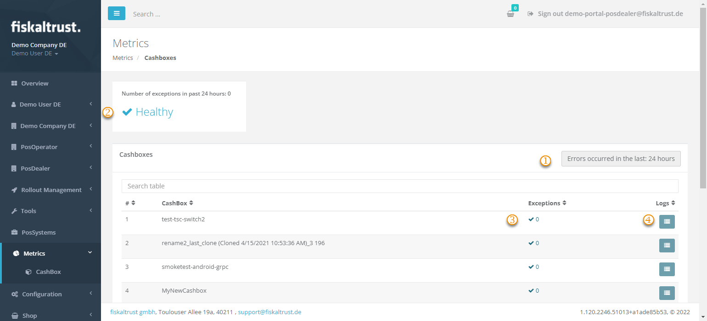
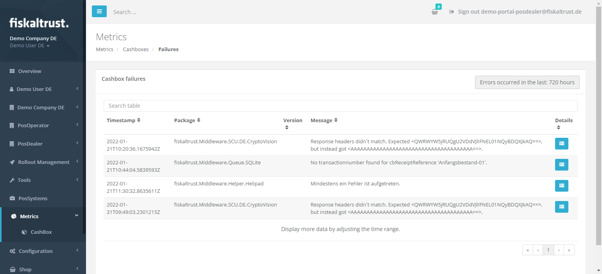

# CashBox failures

:::info summary

After reading this, you can get the information to analyze CashBox failures.

:::

You can analyze CashBox failures remotely using the fiskaltrust.Portal at `Metrics->CashBox` by clicking the button `Go to failed requests` on the tile `CashBox failures`.

:::caution Offline or Opt-out

Using the launcher in [offline mode](../troubleshooting/network-troubleshooting.md#verifying-online-mode) or setting the launcher parameter --telemetry-optout prevents log files from being transferred to the fiskaltrust.Portal. Therefore the Metrics section in the Portal will not be available.
Please keep in mind, that using this will prevent us from actively reacting to issues in the respective customer installations and we will be completely dependent on receiving inquiries and log files manually from you.

:::

| element | description                                                                                                                |
|:----------------------:|-------------------------------------------------------------------------------------------------------------------------------------|
| |The initial view is filtered to view the failures of the last 24 hours. You can change the timeperiod shown here.  |
| |A health indicator showing the number of overall CashBox failures within the filtered timeperiod. |
| |The number of exceptions for each single CashBox. |
| |Click the icon in the column `Logs` to get the detailed CashBox failure log. |

You will find more detailed information about the exceptions here and can even access the stacktrace when clicking on the icon below `Details` to analyze the CashBox failure.

